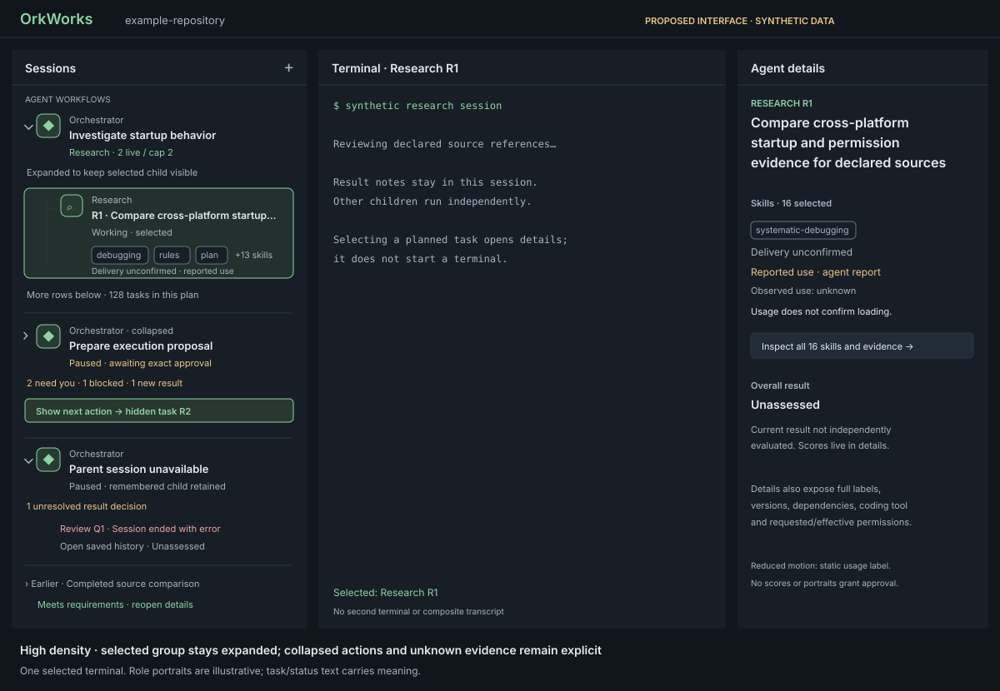

# Agent hierarchy interaction and visual presentation

- Status: proposed interaction/projection contract; written review and upstream agreement pending
- Draft started: 2026-10-04; artifact review: 2026-10-05
- Tracking: [#746](https://github.com/Rambolarsen/orkworks/issues/746), initiative [#738](https://github.com/Rambolarsen/orkworks/issues/738)
- Product direction: [Agent hierarchy and configuration learning](2026-10-04-agent-hierarchy-and-configuration-learning-design.md)
- Accepted scope: [ADR 0077](../../adr/0077-taskmaster-orchestrated-child-sessions.md), [ordinary-child scope alignment](2026-10-04-taskmaster-orchestration-scope-design.md)
- Consumers: [role configuration #741](2026-10-04-agent-role-configuration-design.md), [preparation #742](2026-10-04-orchestrator-preparation-design.md), [skill evidence #743](https://github.com/Rambolarsen/orkworks/issues/743), [evaluation #744](https://github.com/Rambolarsen/orkworks/issues/744)

## Scope and status

Specify the Sessions hierarchy, node details and renderer projection fixtures.
The existing Sessions panel remains the place to find agents; the selected
session retains one terminal. The mockups illustrate a proposed interface,
not an implemented feature or released desktop capture.

The user authorized initial specification/mockup drafting for #746 on
2026-10-04. #610's ordinary-child scope alignment is accepted. This artifact
makes concrete interaction proposals within that direction. It does not finalize
#743/#744 wire records, claim verified adapter support, approve a runtime plan,
or change the authoritative v1 recommendation behavior. Those contract owners
must agree to the projection inputs before runtime planning becomes executable.
Another session owns #745; this task consumes opaque repository identity and
does not define its algorithm, history or learning rules.

### Source investigation

Read against merged baseline `0c6562a1`:

| Existing seam | Established behavior | Design consequence |
| --- | --- | --- |
| `apps/desktop/src/components/SessionListPanel.tsx` | Listbox; Up/Down select a session, Enter focuses its terminal; remembered rows suppress live unread/loud treatment | Introduce hierarchy navigation without manufacturing session IDs or changing ordinary attention semantics |
| `apps/desktop/src/sessionGroups.ts` | Non-dead sessions in Active, dead sessions grouped Today/This week/Earlier | Group ordinary sessions as today; retain a run together when it has declared lineage |
| `apps/desktop/src/sessionSort.ts` | Ordinary activity order is refreshed when IDs change or after 30 seconds | Preserve that path for ordinary rows; freeze hierarchy order within a run |
| `apps/desktop/src/components/SessionDetailPanel.tsx` | Selected-session situation, actions, facts and history; request cleanup prevents stale detail fetches | Extend details with assignment/skills/evaluation; inspect planned nodes separately from active session |
| `apps/desktop/src/workspaceSessionController.ts` | Foreground/admission/polling generations reject stale results; restore only a remembered active ID matching a non-dead session | Fence hierarchy state by workspace/runtime generation; reveal a restored child without selecting its parent |
| `apps/desktop/src/App.tsx`, `sessionUnread.ts` | Actual session selection clears its unread/acknowledges attention | Group inspection/collapse and skill evidence must not acknowledge other sessions |
| `apps/desktop/src/api.ts` | Canonical renderer `SessionInfo` has lifecycle, attention and terminal outcome; no hierarchy/skill/evaluation contract yet | Add a separate proposed read projection; join to canonical session data by validated ID |
| `apps/desktop/src/domain/session.ts` | Separate legacy vocabulary includes `waiting_for_input`, distinct from current `needs_you` | Do not use this model to invent another attention ladder |
| `apps/desktop/src/components/HarnessIcon.tsx` | Coding-tool glyph, grayscale, accessible display name and generic fallback | Portrait indicates role; preserve the coding-tool glyph as separate metadata |

### Uncertainty and blind-spot checkpoint

**What am I least confident about?** How stable hierarchy placement fits the
current activity sort. Investigation confirms grouping/sorting acts on ordinary
session records, with no run owner. Proposal: explicitly partition owned
hierarchies from ordinary rows and preserve declared order within each run.
Runtime implementation will need joined projection fixtures, not an extra
session registry in the renderer.

**What could the project be missing?** Automatic collapse can hide a selected
child, a live session after task completion, or a decision whose summary was
read. The product design already demands preserved selection and visible
blockers. The rules below separate viewed results, coordination outcomes,
session lifetime and unresolved actions. A viewed summary never marks work
accepted, releases capacity, or acknowledges every child's attention.

## Node identity and planned/live/remembered state

A run has one root, with direct declared tasks underneath. An optional plan
heading organizes research/execution revisions; it is a non-session heading,
not another agent. Connectors show delegation only. Do not infer parentage from
branch names, cwd, terminal prose, task labels, or coding-tool-native subagents.

| Node | Identity and display | Selection/action behavior |
| --- | --- | --- |
| Root with parent session | Opaque `runId` plus exact `parentSessionId`; role Orchestrator, immutable goal label | Select its ordinary session; current plan/run state is additional context |
| Planned child | Tuple `(runId, planId, planRevision, taskId)`; role and assignment from that exact proposed/approved configuration | Inspect task/configuration details; label “Planned · not started”; no terminal, fake session, launch, kill or resume action |
| Allocating child | Same tuple; server reservation indicates starting | Label “Starting · session not available”; still no terminal until an exact child ID is projected |
| Started child | Same tuple plus server-bound `childSessionId` and configuration digest | Join exactly one canonical SessionInfo; retain the task row key when it starts |
| Remembered child/root | Joined session lifecycle `dead`, with its terminal outcome/resume availability | Select ordinary saved terminal/history; no live unread treatment; resume is a separate server-validated action |
| Missing parent/session | Valid owned task/root reference whose session record is unavailable | Show “Parent session unavailable” or “Session unavailable”; preserve other children and details without a replacement session |
| Ordinary session | Canonical session ID without validated orchestration membership | Existing grouping, label, coding-tool icon, status and ordinary actions |

Presentation phase `planned`, `starting`, `session`, or `session-unavailable`
is separate from ordinary lifecycle and memoryState. An alive child whose task
result is complete stays alive and consumes capacity until the backend says it
is terminal. A remembered session's old attention does not become a live
request. A session ID must appear in only one place; suppress its ordinary-row
duplicate only after its exact hierarchy membership validates.

A newer plan revision gets new task keys; no result/delivery/viewed state
transfers by label or task ID alone. Previously launched children retain their
original plan identity and remain selectable under that run. Plans are shown
in server-declared creation order, tasks in ordered-batch/declaration order.
Unlaunched obsolete revisions appear in run history details rather than as
current planned nodes. A missing parent does not revoke ordinary child
management or grant the renderer permission to resume orchestration.

## Portrait, role, task, status, and skill badge priority

Use a compact, indented row with a recognizable 28px role portrait, role name,
short task label, textual status and compact skill badges. At high density the
portrait is 24px. Reuse stable role artwork for Orchestrator, Research,
Implementation, Review, Verification and Remediation. Individual task labels
and accessible names distinguish agents sharing artwork. Preserve a generic
agent fallback when art is absent; hide decorative portraits from assistive
technology because the role/task text supplies their meaning.

Priority is required action/status, role/task identity, skills, then coding tool
and last activity. Portraits never outrank blockers. Parent-child lines use
subtle strokes without arrows that could imply dependencies. No persistent XP,
rarity, currency, ranking or rewards. Existing attention tone owns status color;
portraits and coding-tool marks do not invent a competing status system.

Show one overall result, exactly **Meets requirements**, **Needs rework**, or
**Unassessed**, when an assignment has a projected evaluation. Planned work
uses “Unassessed · not started” in details. Current failed criteria/quality
produce Needs rework; missing/stale/conflicting evidence cannot produce Meets
requirements. Worker self-assessment remains labeled as such in details.
The renderer consumes #744's authoritative result; it does not calculate scores,
average reviewers, reinterpret terminal exit, or infer acceptance.

For rows narrower than 320px, allow two task lines and move status to its own
line; use a 260px reference minimum, vertical scrolling and no horizontal
scrolling. Full labels remain available in details and accessible names, not
only tooltips. Rows grow with text zoom; dimensions are nominal, not clipping
limits. Use plain text rendering for all task labels/evidence excerpts; never
interpret them as HTML or shell commands.

### Skill badges

Delivery and usage are independent axes from #743, joined to the exact
configuration, skill version/content digest, child and launch generation.

| Delivery/usage evidence | Row appearance and text | Meaning |
| --- | --- | --- |
| Selected/planned, no delivery confirmation | Outlined badge, “Selected” (planned) or “Delivery unconfirmed” (started) | Approved/proposed choice, not proof of loading |
| Confirmed delivery | Filled badge with check glyph and “Loaded” | Verified content-delivery receipt for this configuration; not adherence |
| Agent-reported usage | Optional brief soft highlight plus “Reported use” indicator; keep delivery styling | Reported application; not a native observed invocation |
| Verified adapter invocation | Same restrained highlight plus “Observed use” indicator; keep delivery styling | Recognized invocation with source/coverage from eligible adapter |
| Unavailable usage | “Usage unknown” in details; no invented zero or unused state | Missing evidence cannot establish non-use |
| Stale/invalidated delivery or usage | No current confirmation/highlight; “Evidence unavailable” in details, historical evidence preserved | A mismatched revision/generation cannot decorate the current assignment |

A usage report can highlight an outlined badge. It cannot fill it. Selection,
terminal mentions, Peon inference, process activity, or current reviewer scores
cannot confirm loading. Changing a skill version does not carry over badges
from the previous content. Required/optional status and selection reasons live
in details, with required skills labeled explicitly.

Show at most three badges in a row in selected configuration order, followed by
“+N skills” when more exist. Never hide an action behind this overflow. Details
show all up to 16 skills under the role contract's bound, including name,
version/content identity, description, selection reason, delivery status,
reported/observed source, coverage, time and bounded evidence references.
Relevant repository history is displayed only when #745 supplies it; absent
history reads “History unavailable”, never an invented skill score.

Proposed motion constants: one 600ms soft highlight, no flashing; coalesce bursts
per badge over two seconds; deduplicate stable event IDs before scheduling it.
Initial snapshots/history loads never replay old animations. New receipts are
animated only while visible in the current workspace; expand does not replay
hidden usage. Reduced-motion preference removes all animation and uses a static
“Reported use”/“Observed use” marker. Markers remain until the inspected evidence
changes; motion is never the only usage/source indication. #743 owns event
retention and dedupe; UI scheduling state is bounded to visible current badges.

## Stable placement and collapse behavior

Place owned runs under **Agent workflows** and ordinary sessions under their
existing **Active / Today / This week / Earlier** sections. Runs have a stable
server creation-sequence order with run ID as a deterministic tie breaker;
refreshing attention, usage or activity does not reorder them. A new run is
inserted once at its sequence position. Within each run, plan headings and
ordered batch/task positions remain fixed; children do not jump when they
become blocked or report a result. Attention counts and explicit “Show next
action” navigation provide urgency without sorting children by attention.

Only two agent levels exist: root and direct children. Plan headings add
visual grouping, not delegation levels. Active runs start expanded. Manual
collapse/expand does not acknowledge unread sessions or change outcomes.
New plans append their declared rows under the existing parent rather than
reusing old task positions. Inspection explicitly reveals its ancestry and
scrolls only enough to show the target.

### Viewed-summary and automatic-collapse rules

Keep UI-only state keyed by workspace, run, exact result subject/revision and
summary revision. A summary is viewed only after the user opens its current
result in details/run summary; mounting a hidden panel, polling, scrolling past
a row, or selecting a parent is insufficient. No saved viewed state asserts
approval, acceptance, evaluation freshness or readiness.

Automatic collapse is eligible only when all of these hold:

1. The backend says the displayed plan/run is coordination-terminal. Research
   completion while the run continues planning is not a completed run.
2. Every current result summary in that group has been explicitly opened; a
   missing result/summary prevents eligibility rather than being assumed read.
3. No pending approval, clarification, unresolved blocker, failure requiring
   action, unreviewed changed result, allocation/recovery problem or nonterminal
   child/reservation remains. A reported result never ends its live session.
4. Selection, inspected node and keyboard focus are outside the group.
5. That exact result revision has not already been automatically collapsed.

Defer eligible collapse while the user inspects a descendant. Collapse when
they subsequently leave, without changing their selected session. Reopening
suppresses another automatic collapse for that same revision, including after
a refresh. A changed result resets viewed eligibility and suppression for that
new revision; do not collapse immediately before it is viewed.

Manual collapse is allowed for active groups only when it will not hide the
selected or inspected child or the focused descendant. When it is blocked,
show the named cause beside the disclosure and announce it politely:

- Selected child: “Select the parent or another session to collapse this group.”
  That explicit selection uses the ordinary session-selection path; the collapse
  request itself never changes the terminal.
- Inspected child only, including planned work: “Inspect the parent or another
  task to collapse this group.” Activating the parent’s Inspect details command
  moves inspection to the root without changing the current terminal.
- Focused descendant only: “Move focus to the parent to collapse this group.”
  Left moves tree focus to the root without selecting its terminal; its sibling
  disclosure toolbar is then usable.

Focus inside a child's skill/result details or child toolbar counts as that
child's descendant focus. Focus on the root disclosure/toolbar is not descendant
focus and does not itself block manual collapse. It still counts as inside the
group for automatic-collapse protection. If several causes apply, name all and
require all to clear. A blocked manual request is not queued for later execution.
The user explicitly retries disclosure after moving selection/inspection/focus.
There is no partially collapsed tree or duplicated pinned session row.
`aria-expanded=false` means its child group is hidden, and `true` means that
group is open, following the
[WAI tree pattern](https://www.w3.org/WAI/ARIA/apg/patterns/treeview/).
A deleted focused node moves focus to its surviving parent or next visible row
without implicitly selecting a replacement terminal.

Remember collapse/viewed preferences only in a bounded local UI cache: proposed
limit 64 run entries per workspace, session-local until persistence is separately
reviewed. Evict least-recently-inspected inactive UI entries; never backend
ownership, result or replay records. New workspace/runtime adoption clears
transient focus, animation and inspected-detail requests. Explicit session
restoration expands the matching child even if its cached group was collapsed.

## Blocked-child and required-action discoverability

Every root shows a rollup based on current child/run projections, including
collapsed children: “2 need you · 1 blocked · 1 new result”, with source labels
in details. Distinct categories count distinct task/session/action identities
within each category; overlapping categories are not summed into a total.
Do not paint the parent session Needs You just because a child needs input.
Group action counts are presentation data, not writes to parent attention.

Keep these signals separate:

- Live session attention/unread from the existing session contract; remembered
  sessions keep final-outcome text and dimming, without live unread/loud styling.
- Run/task blockers and required UI decisions from exact #610/#742 identities;
  a remembered child can still have an unresolved result or plan decision.
- Unviewed result summaries from exact result revisions, independent of ordinary
  unread state. Viewing a summary never acknowledges other sessions.

Collapsed roots retain textual counts, blocker reason and a named “Show next
action” control outside the tree's roving-focus surface. It expands and reveals
the earliest actionable target in stable plan/task order; repeated activation
cycles through current targets. A live child target uses normal session
selection; a run/plan decision opens its version-bound details with the current
terminal retained. Navigating to it does not approve or resolve it. New attention
updates the rollup without expanding, changing selection or stealing focus.
“No actions” appears only from a complete current projection; failed refreshes
show “Action state unavailable” and disable stale decision controls.

## Dependency labels distinct from parentage

Each waiting planned task states its declared reason: “Waiting for task R1”,
“Waiting for batch 2”, “Awaiting plan approval”, “Run capacity full (2/2)”, or
“Launch paused: task I1 blocked”. Details expose exact dependency tasks and
batch/capacity constraints. Do not synthesize a scheduler or assume that a
parent result launches children. A finished research task can leave a live
session counted in run capacity; show “Result received · session still alive”.
A successful evaluation does not advance a dependency. Current coordination
results, readiness and approval remain server-owned and version-bound.

## Single terminal and ordinary-session fallback

Separate local `focusedNodeKey`/`inspectedNodeKey` from canonical
`activeSessionId`. Selecting a started/remembered node goes through the existing
session-selection path, including its per-session unread acknowledgement and
saved active ID. Selecting a planned/missing-session node changes only inspected
details. Keep the terminal labeled with its actual active session and show
“Viewing planned task; terminal remains Research R1” in details when different.
Do not send plan/task keys to terminal APIs or select a parent as a fallback.

A skill click opens that node's skill details without focusing the terminal;
keyboard users have an equivalent “Inspect skills” action in the tree's sibling
toolbar. Detail navigation does not type into the session or load a second
terminal/transcript. Parent/root selection uses its ordinary terminal, not a
composite terminal for all agents. Remembered selection keeps saved scrollback
and resume choices; it does not resume automatically.

Preserve controller foreground/admission/polling fencing. Each hierarchy,
evaluation, skill and detail fetch captures workspace identity, sidecar/runtime
generation and exact subject/configuration. Apply only if all still match; an
older snapshot cannot regress newer subject/result versions. On workspace
switch, clear inspected hierarchy state before painting the new workspace.
Restore `lastActiveSessionId` only under the existing non-dead-match policy;
reveal that session's exact lineage when available. No parent/session launch
or cross-instance aggregation is a selection side effect.

If the hierarchy extension is absent, render the existing list. If it is
present but malformed, render canonical sessions ordinarily, show “Workflow
structure unavailable”, and disable hierarchy/approval/evidence claims. Do not
silently draw guessed edges. Unknown optional role artwork has a generic
fallback; invalid lineage/versions/digests do not. Individual valid sessions
remain available for ordinary management while the structure is unavailable.
A referenced but missing parent is an explicit valid state, not malformed
lineage; show its run heading and surviving children.

## Keyboard, accessibility, and reduced motion

When valid hierarchy nodes are present, use one labeled tree containing run
roots/children and ordinary-session leaf items; section/plan labels are
noninteractive headings described by the items. Use explicit `aria-level`,
`aria-posinset`/`aria-setsize`, `aria-expanded` only for items with visible child
relationships, and `aria-selected` only for the canonical active session.
A planned inspected node has an “Inspecting planned task” description and focus
outline, without pretending to be the active terminal. Pure ordinary fallback
retains the current listbox.

Use one roving tab stop on a treeitem, no nested tabbable badge/kill controls.
Put disclosure, Inspect skills, Show next action, result and lifecycle commands
in a sibling toolbar labeled for the focused/inspected node. Pointer shortcuts
on badges/disclosure invoke the same commands; all have keyboard equivalents.
Never place actionable buttons inside a selectable treeitem's accessible name.

| Key within the tree | Behavior |
| --- | --- |
| Up / Down | Previous/next visible node, bounded at ends; ordinary/session nodes follow current session selection behavior, planned/missing nodes inspect only |
| Home / End | First/last visible node, same selection-versus-inspection rule |
| Right | Expand omitted children; if fully expanded, focus first child using the same selection rule |
| Left | Collapse siblings/children under the focused parent; from a child focus its root, without selecting the root terminal until explicitly activated |
| Space | Select/inspect the focused node while keeping tree focus |
| Enter | Existing session: select then focus its terminal; planned/unavailable: focus its details heading without launch |
| Tab / Shift+Tab | Move to/from sibling toolbar and normal panel controls; no focus trap |
| Escape in skill/result details | Return focus to the invoking node or surviving root; do not revert active terminal |

Keep the current Sessions panel shortcut and existing panel/terminal shortcuts;
add no conflicting global accelerator. Pointer row selection returns keyboard
focus to the tree as the current list does. Disclosure-only clicks never
change the active terminal. After explicit selection restoration or toolbar
navigation, expand/reveal the target before focusing it. Refresh alone does
not focus or scroll to a new child.

Accessible names include role, full task label, textual lifecycle/attention,
planned/session-unavailable qualifier and current result when present. Expose
skill names/delivery/use labels in descriptions and details. Do not rely on
color, fill, connecting lines, animation or hover. Tree focus and terminal
selection use distinguishable outlines and textual “Selected”/“Inspecting” cues.
Use a polite live region for changed required-action counts, coalesced over two
seconds; announce neither every usage event nor terminal output through it.
At 200% text zoom and reduced motion, all statuses/actions remain available.

## Renderer projection and contract fixtures

These are proposed UI input records and consumer requirements, **not** a new
runtime API schema. #741/#742 own configuration/authority identity, #743 owns
delivery/usage, and #744 owns result/evaluation. Exact wire names, retrieval,
bounds, retention and owner agreement remain review gates.

| Proposed input | Required meaning |
| --- | --- |
| `HierarchySnapshot` | Workspace identity, current runtime generation, monotonically versioned snapshot identity, runs and validated session joins; explicit complete/unavailable status |
| `RunProjection` | Exact run ID/creation sequence, repository identity reference, parent session ID or explicit unavailable reference, immutable goal, version-bound run/plan state, current action targets, backend live-child/reservation counts |
| `TaskProjection` | Exact run/plan/revision/task tuple, declared batch/order/dependencies, role, label, immutable configuration digest, optional exact child ID, reservation phase, coordination outcome and current subject/result reference |
| `SkillProjection` | Exact skill ID/version/content digest and configuration/child/generation binding, separate delivery/usage source/coverage, current evidence references, stable usage event identities or authoritative dedupe cursor |
| `EvaluationProjection` | Current result subject/revision, overall result from #744, reviewer/source references, current/stale/conflicting status; optional detail scores with no renderer derivation |
| `ActionTarget` | Opaque action ID, exact subject/version, reason/type and target node; display/navigation only, no token, grant, bearer, terminal input or arbitrary endpoint |

Join uses validated ownership references, never a second renderer session map.
Ordinary `SessionInfo` remains the lifecycle/status source. Proposed finite UI
budget: one run root plus up to 16 plan headings and up to 128 tasks per visible
plan; up to 16 skills per node. Use windowed rendering or explicit progressive
reveal for large collections, retain total counts and a direct reveal path to
selected/action targets, and never hide required actions behind pagination.
A run can retain 16 plans under #742; do not assume 128 is a run-wide task cap.
A corrupt/oversized projection is rejected visibly, without truncating
ownership or turning a partial scan into “No actions”. Ordinary session history
continues using its existing bounds.

Illustrative fixture notation below is logical, not accepted HTTP JSON:

```json
{
  "fixture": "usage-without-delivery",
  "taskRef": { "runId": "run-a", "planId": "execution-a", "planRevision": 2, "taskId": "I1" },
  "sessionRef": "child-a",
  "configurationRef": "fixture-config-I1",
  "skill": { "id": "systematic-debugging", "version": "fixture-v1", "delivery": "unconfirmed", "usage": "agent-reported", "eventId": "event-7" },
  "expected": { "badge": "outlined", "label": "Delivery unconfirmed; reported use", "filled": false }
}
```

`configurationRef` above names a synthetic fixture; production uses the exact
64-character digest and validated upstream identity. Fixtures never contain
real prompts, credentials, transcripts, private repo names or tool observations
invented as evidence. All mockup records are synthetic.

### Contract cases required before implementation

| Fixture / trigger | Expected projection and interaction |
| --- | --- |
| Planned R1 starts with exact child ID | Same task row key/order, status from canonical session; terminal exists only after selecting its real ID |
| Label-identical tasks in new revision | New identity; no carryover of loaded badges, viewed summaries or evaluation |
| Reported event on unconfirmed skill; duplicate event | Outline plus Reported use; highlight at most once, never fills |
| Loaded skill with unknown usage | Filled Loaded badge; usage stays Unknown in details |
| Old generation delivery/event/evaluation arrives | Ignore current decoration; no old receipt promoted into current evidence |
| Invalidated/changed/conflicting evaluation | Unassessed or Needs rework as #744 projects; no current Meets requirements inferred |
| Completed task but alive child / unattached reservation | Show backend live capacity; prevent automatic collapse and any slot release |
| Completed research, execution awaiting approval | Same root expanded; visible exact-plan decision; no inherited execution approval |
| User approves the current exact plan/version through Electron main | Replace the pending decision with server-confirmed approval; planned nodes stay not-started until an exact session join arrives; UI acknowledgement alone launches nothing |
| User denies/declines the current proposal | Reflect the server-confirmed denied/disposition state; no worktrees/children created by navigation; preserve already-owned children and ordinary management; declining execution does not imply research-only finish without #742's separate finish action |
| Approval denied for drift or an old action version | Keep decision unresolved, show the backend reason and refreshed exact proposal; no success decoration, transferred grant or silent retry |
| All current summaries opened, user inside group | Defer collapse; selected terminal/focus preserved |
| Eligible collapse, reopen, repeat refresh | Collapse once; reopening suppression retained for the same exact result revision |
| Manual collapse with selected/inspected/focused child | Keep group fully expanded; explain each applicable cause and its explicit root selection, root inspection, or Left-to-root path; root disclosure remains usable after causes clear; no queued request or terminal switch |
| Hidden child gains Needs You | Root count changes, no selection/focus theft; Show next action reveals that exact child |
| Dead child has terminal error plus unresolved review | Dim ordinary remembered row; distinct actionable run decision, no live unread |
| Missing parent; surviving child | Unavailable parent label, child selectable normally; no replacement parent/automatic resume |
| Corrupt lineage / absent extension | Visible unavailable warning plus ordinary list, or unchanged ordinary list when absent |
| 128 tasks/plan, 16 plans, long labels, 16 skills | Stable order, scroll/reveal access, +13 skills with all details; full accessible text |
| Workspace switch and late detail/snapshot | New workspace never paints old node, summary, badge, action or animation |
| Restored active child in collapsed group | Reveal its exact ancestry; one active terminal, no parent fallback |
| Forget selected/focused child | Use ordinary lifecycle confirmation/selection clearing; focus moves safely without launching another session |
| Keyboard / 200% text zoom / reduced motion | Every required action and skill detail reachable; no clipped status or motion-only information |

### Authority and Electron boundary

The sidecar projects validated relationships/results and authoritative action
availability. Electron main owns exact version-bound orchestration approval,
resume/cancel/finish commands under #610/#742; the UI cannot grant launch rights
by changing a badge, score, tree selection or cached result. Proposed workflow
actions open the reviewed approval/details surface; drift rejects stale approval
and requires a fresh displayed proposal. The renderer receives no UI token,
run bearer or plan grant. No new terminal typing shortcut is introduced.

Keep `electron/` and `src/` independent. Any eventual IPC contract gets separate
validated definitions/tests on both sides; never import renderer types into
Electron or alter rootDir. This task adds no IPC, session route, runtime code,
new renderer authorization decision or separate child-sidecar registry.

## Low/high-density mockups and usability review

The reference mockups preserve the three existing surfaces: Sessions hierarchy,
one selected terminal, and selected/inspected details. Status wording, skill
receipt source and required-action discoverability are normative proposals;
exact portrait artwork and pixel spacing remain presentation choices.

### Low density: research and planned verification


A selected Research R1 has two Loaded skills. Research R2 needs input with
unconfirmed delivery. An outlined verification row waits for its declared batch and cannot start
from selection. “Show next action” has a visible purpose and the detail surface
keeps coding-tool/permissions/evaluation subordinate to the task.

### High density: collapsed attention, long labels and unknown evidence



The selected child stays in its expanded group; a separate collapsed group
retains its textual action rollup. Long task/skill sets use details and overflow without enlarging the
terminal into multiple views. A missing-parent group remains manageable;
a completed workflow has an explicit overall result rather than numeric scores
or reward decoration. Unknown delivery and reported use can coexist.

### Bounded usability walkthrough

Design-review tasks, using the synthetic mockups and contract cases:

| User task | Expected route and success condition |
| --- | --- |
| Find a blocked/Needs You child in a collapsed workflow | Read root counts; Show next action reveals the target within two activations; terminal selection uses the exact child ID |
| Tell whether a highlighted skill was loaded | Read Delivery unconfirmed versus Loaded, then inspect source; a reported highlight must not be mistaken for confirmation |
| Inspect a planned verification task while coding continues | Inspect planned details; terminal remains labeled with the current actual child; no launch/resume affordance |
| Find the full assignment and all 16 skills | Open details/+13 skills; no hover dependency or lost status |
| Reopen completed work and find a revised result | Reopen persists for same revision; changed result is unviewed/currently unassessed until the appropriate evidence arrives |
| Navigate with keyboard and reduced motion | Tree → labeled toolbar → skill/action details → Escape to invoking node, with no hidden selected child |

The author performed a source/fixture consistency walkthrough. Rendered SVG
layout checks and independent artifact review are recorded in the PR. This is
an expert walkthrough, not a claim of measured user usability or a shipped
screen-reader implementation. Written user review must confirm blocker finding,
density and focus/collapse choices before these interactions become binding.

## Execution handoff and implementation gate

Current deliverables: this proposed specification, two synthetic SVG mockups,
contract-case matrix and review questions. Keep #746 open until the reviewed
projection agreement and scoped execution handoff are complete. Do not close
#610 or #740–#745 through this documentation PR.

Review questions for component owners:

- #741/#742: confirm exact run/plan/task/configuration/result identity and
  version-bound action targets, including missing parents and live capacity.
- #743: confirm delivery/usage freshness, invalidation, stable-event dedupe,
  source/coverage and bounded skill detail inputs. Outline/fill never derives
  from a usage claim.
- #744: confirm current overall-result projection, subject revision, failure
  precedence and correction/conflict behavior; UI never self-calculates review.
- #745: supply opaque repository identity and optional history references;
  failure to read history cannot block ordinary session inspection.
- User: review stable placement, selection-protected disclosure behavior, summary-view
  eligibility, density and the keyboard inspection/selection distinction.

After written review/upstream agreement, create a separate implementation issue
and executable plan for each testable unit: (1) validated sidecar read projection
and canonical session joins; (2) pure renderer hierarchy/order/rollup and UI-state
reducer with race/identity fixtures; (3) Sessions/detail presentation, keyboard,
zoom/reduced-motion and single-terminal integration tests. Approval UI/IPC belongs
to the separately reviewed #610/#742 unit and must be linked, not implemented
as a renderer shortcut. Runtime plans name concrete source/test files and
meaningful failing fixtures, use TDD and explicit /code-review effort, and run
required CI. Missing upstream contracts stay explicit blockers; this document
is not a speculative executable runtime plan.

Documentation validation for this task: VitePress build/dead links, doc drift,
diff whitespace, SVG render/overflow inspection and bounded independent
correctness/completeness review. No live model probes, capability enforcement
tests or product behavior are implied by passing those checks.
