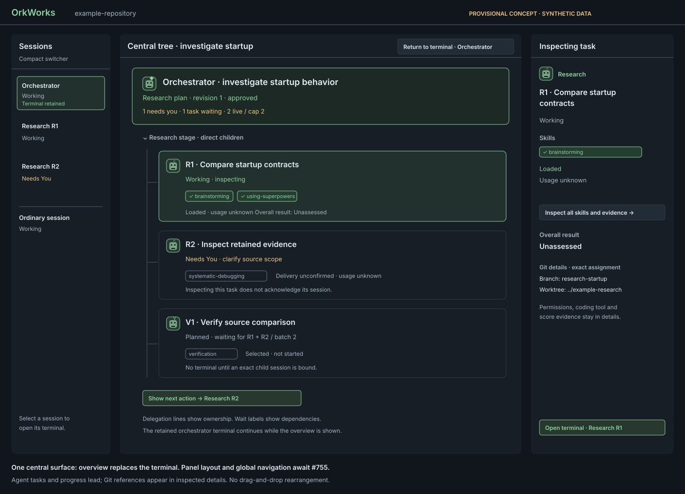

# Agent hierarchy interaction and visual presentation

- Status: proposed interaction/projection contract; written review and upstream agreement pending
- Draft started: 2026-10-04; artifact review: 2026-10-05
- Shell prerequisite: [#755](https://github.com/Rambolarsen/orkworks/issues/755); final placement/navigation awaiting shell review
- Tracking: [#746](https://github.com/Rambolarsen/orkworks/issues/746), initiative [#738](https://github.com/Rambolarsen/orkworks/issues/738)
- Product direction: [Agent hierarchy and configuration learning](2026-10-04-agent-hierarchy-and-configuration-learning-design.md)
- Accepted scope: [ADR 0077](../../adr/0077-taskmaster-orchestrated-child-sessions.md), [ordinary-child scope alignment](2026-10-04-taskmaster-orchestration-scope-design.md)
- Consumers: [role configuration #741](2026-10-04-agent-role-configuration-design.md), [preparation #742](2026-10-04-orchestrator-preparation-design.md), [skill evidence #743](https://github.com/Rambolarsen/orkworks/issues/743), [evaluation #744](https://github.com/Rambolarsen/orkworks/issues/744)

## Shell proposal handoff: 2026-10-05

The [application-shell/navigation proposal](2026-10-05-application-shell-navigation-design.md)
now stages compact Sessions, alternative central Workflow/Terminal/Review
surfaces, explicit task-inspection versus session-selection transitions,
context-bound details, narrow/zoom navigation, and saved-layout migration.
Its six synthetic shell drawings extend this document's provisional overview
concepts. Written owner acceptance and authoritative ADR/spec reconciliation
remain open; these links do not accept either visual design or authorize code.

## Scope and status

Specify workflow nodes, evidence, action discovery and renderer projection
fixtures for a central tree or branching timeline. On 2026-10-05 the user
rejected the Sessions-embedded hierarchy as too intrusive and requested a
central overview in place of the terminal, with paths appearing as work
progresses. Keep Sessions as a compact switcher of actual sessions.

The broader move away from tab-based panels, including removal of drag-and-drop
panel rearrangement, is queued in [#755](https://github.com/Rambolarsen/orkworks/issues/755).
This revision records that direction and compares two provisional overview
concepts. It does not select a final shell, layout library or global navigation
scheme. #755 must resolve those choices and reconcile this draft before final
written acceptance of #746. The mockups are synthetic concept drawings, not
implemented features or released desktop captures.

The user authorized initial specification/mockup drafting for #746 on
2026-10-04 and continued the design revision on 2026-10-05. #610's ordinary-child
scope alignment is accepted. This artifact does not finalize #743/#744 wire
records, claim verified adapter support, approve a runtime plan, or change v1
recommendation behavior. Those contract owners must agree to the projection
inputs before runtime planning becomes executable. Another session owns #745;
this task consumes opaque repository identity without defining its algorithm,
history or learning rules.

### Source investigation

Read against merged baseline `0c6562a1`:

| Existing seam | Established behavior | Design consequence |
| --- | --- | --- |
| `apps/desktop/src/components/SessionListPanel.tsx` | Listbox; Up/Down select a session, Enter focuses its terminal; remembered rows suppress live unread/loud treatment | Keep the compact session index; put workflow inspection in a separate central surface |
| `apps/desktop/src/sessionGroups.ts` | Non-dead sessions in Active, dead sessions grouped Today/This week/Earlier | Keep ordinary session grouping; group declared work by run only in the overview |
| `apps/desktop/src/sessionSort.ts` | Ordinary activity order is refreshed when IDs change or after 30 seconds | Preserve activity sorting in the switcher; keep workflow paths stable separately |
| `apps/desktop/src/components/SessionDetailPanel.tsx` | Selected-session situation, actions, facts and history; request cleanup prevents stale detail fetches | Bind overview details to its inspected node; terminal details to its actual session |
| `apps/desktop/src/workspaceSessionController.ts` | Foreground/admission/polling generations reject stale results; restore only a remembered active ID matching a non-dead session | Fence hierarchy state by workspace/runtime generation; reveal a restored child without selecting its parent |
| `apps/desktop/src/App.tsx`, `sessionUnread.ts` | Actual session selection clears its unread/acknowledges attention | Group inspection/collapse and skill evidence must not acknowledge other sessions |
| `apps/desktop/src/api.ts` | Canonical renderer `SessionInfo` has lifecycle, attention and terminal outcome; no hierarchy/skill/evaluation contract yet | Add a separate proposed read projection; join to canonical session data by validated ID |
| `apps/desktop/src/domain/session.ts` | Separate legacy vocabulary includes `waiting_for_input`, distinct from current `needs_you` | Do not use this model to invent another attention ladder |
| `apps/desktop/src/components/HarnessIcon.tsx` | Coding-tool glyph, grayscale, accessible display name and generic fallback | Portrait indicates role; preserve the coding-tool glyph as separate metadata |

### Uncertainty and blind-spot checkpoint

**What am I least confident about?** Whether “branches” meant agent work paths
or Git branches. The user explicitly clarified on 2026-10-05: agent tasks and
progress lead; Git details belong on inspection. The accepted scope declares
direct children, explicit batches/dependencies and new exact approval for
additions/retries. Paths therefore represent workflow assignments; show exact
Git branch/worktree references only in inspected details when upstream records
supply them. No branching policy or Git operation follows from the drawing.

**What could the project be missing?** A timeline can look like a complete event
history even when its source is a current projection and a bounded notification
ring. #742 retains exact plan/report records but its notification ring can lose
old events. Use retained plan stages and results for the overview, not replayed
notifications or invented timestamps. Another important constraint is ADR 0013:
its current Sessions-as-multi-view wording and session-bound detail panel need
explicit review in #755 for a central overview. Preserve its one-active-context
principle: overview and terminal are alternative central surfaces; overview
inspection must not show a different session's detail beside a visible terminal.

## Node identity and planned/live/remembered state

A run has one root, with direct declared tasks underneath. An optional plan
heading organizes research/execution revisions; it is a non-session heading,
not another agent. Connectors show delegation only. Do not infer parentage from
branch names, cwd, terminal prose, task labels, or coding-tool-native subagents.

| Node | Identity and display | Selection/action behavior |
| --- | --- | --- |
| Root with parent session | Opaque `runId` plus exact `parentSessionId`; role Orchestrator, immutable goal label | Inspect run details; Open terminal explicitly selects its ordinary session |
| Planned child | Tuple `(runId, planId, planRevision, taskId)`; role and assignment from that exact proposed/approved configuration | Inspect task/configuration details; label “Planned · not started”; no terminal, fake session, launch, kill or resume action |
| Allocating child | Same tuple; server reservation indicates starting | Label “Starting · session not available”; still no terminal until an exact child ID is projected |
| Started child | Same tuple plus server-bound `childSessionId` and configuration digest | Join exactly one canonical SessionInfo; retain the task row key when it starts |
| Remembered child/root | Joined session lifecycle `dead`, with its terminal outcome/resume availability | Inspect historical result; Open history explicitly selects saved terminal; resume remains separate |
| Missing parent/session | Valid owned task/root reference whose session record is unavailable | Show “Parent session unavailable” or “Session unavailable”; preserve other children and details without a replacement session |
| Ordinary session | Canonical session ID without validated orchestration membership | Existing grouping, label, coding-tool icon, status and ordinary actions |

Presentation phase `planned`, `starting`, `session`, or `session-unavailable`
is separate from ordinary lifecycle and memoryState. An alive child whose task
result is complete stays alive and consumes capacity until the backend says it
is terminal. A remembered session's old attention does not become a live
request. Keep one canonical entry per actual session in the compact switcher.
A workflow
node may reference that same ID in the alternative central overview; it is not
a second session record. Planned nodes never enter the session switcher.

A newer plan revision gets new task keys; no result/delivery/viewed state
transfers by label or task ID alone. Previously launched children retain their
original plan identity and remain selectable under that run. Plans are shown
in server-declared creation order, tasks in ordered-batch/declaration order.
Retain earlier plan stages and launched paths with their exact result versions.
Unlaunched obsolete revisions appear as explicitly superseded history, never
current launchable work. Their task details can be disclosed without cluttering
the current stage. A missing parent does not revoke ordinary child
management or grant the renderer permission to resume orchestration.

## Portrait, role, task, status, and skill badge priority

Use a compact tree row or timeline card with a recognizable 28px role portrait,
role name,
short task label, textual status and compact skill badges. At high density the
portrait is 24px. Reuse stable role artwork for Orchestrator, Research,
Implementation, Review, Verification and Remediation. Individual task labels
and accessible names distinguish agents sharing artwork. Preserve a generic
agent fallback when art is absent; hide decorative portraits from assistive
technology because the role/task text supplies their meaning.

Priority is required action/status, role/task identity, skills, then coding tool
and last activity. Portraits never outrank blockers. Delegation connectors use
subtle strokes without arrows that could imply dependencies. Stage/time labels
are separate from delegation and declared wait reasons. No persistent XP,
rarity, currency, ranking or rewards. Existing attention tone owns status color;
portraits and coding-tool marks do not invent a competing status system.

Show one overall result, exactly **Meets requirements**, **Needs rework**, or
**Unassessed**, when an assignment has a projected evaluation. Planned work
uses “Unassessed · not started” in details. Current failed criteria/quality
produce Needs rework; missing/stale/conflicting evidence cannot produce Meets
requirements. Worker self-assessment remains labeled as such in details.
The renderer consumes #744's authoritative result; it does not calculate scores,
average reviewers, reinterpret terminal exit, or infer acceptance.

For nodes narrower than 320px, allow two task lines and move status to its own
line; use a 260px reference minimum, vertical scrolling and no horizontal
scrolling. Full labels remain available in details and accessible names, not
only tooltips. Nodes grow with text zoom; dimensions are nominal, not clipping
limits. Use plain text rendering for all task labels/evidence excerpts; never
interpret them as HTML or shell commands.

### Skill badges

Delivery and usage are independent axes from #743, joined to the exact
configuration, skill version/content digest, child and launch generation.

| Delivery/usage evidence | Row appearance and text | Meaning |
| --- | --- | --- |
| Selected/planned, no delivery confirmation | Outlined badge, “Selected” (planned) or “Delivery unconfirmed” (started) | Approved/proposed choice, not proof of loading |
| Confirmed delivery | Filled badge with check glyph and “Loaded” | Verified content-delivery receipt for this configuration; not adherence |
| Agent-reported usage | Optional brief soft highlight plus “Reported use” indicator; keep delivery styling | Reported application; not a native observed invocation |
| Verified adapter invocation | Same restrained highlight plus “Observed use” indicator; keep delivery styling | Recognized invocation with source/coverage from eligible adapter |
| Unavailable usage | “Usage unknown” in details; no invented zero or unused state | Missing evidence cannot establish non-use |
| Stale/invalidated delivery or usage | No current confirmation/highlight; “Evidence unavailable” in details, historical evidence preserved | A mismatched revision/generation cannot decorate the current assignment |

A usage report can highlight an outlined badge. It cannot fill it. Selection,
terminal mentions, Peon inference, process activity, or current reviewer scores
cannot confirm loading. Changing a skill version does not carry over badges
from the previous content. Required/optional status and selection reasons live
in details, with required skills labeled explicitly.

Show at most three badges in a row in selected configuration order, followed by
“+N skills” when more exist. Never hide an action behind this overflow. Details
show all up to 16 skills under the role contract's bound, including name,
version/content identity, description, selection reason, delivery status,
reported/observed source, coverage, time and bounded evidence references.
Relevant repository history is displayed only when #745 supplies it; absent
history reads “History unavailable”, never an invented skill score.

Proposed motion constants: one 600ms soft highlight, no flashing; coalesce bursts
per badge over two seconds; deduplicate stable event IDs before scheduling it.
Initial snapshots/history loads never replay old animations. New receipts are
animated only while visible in the current workspace; expand does not replay
hidden usage. Reduced-motion preference removes all animation and uses a static
“Reported use”/“Observed use” marker. Markers remain until the inspected evidence
changes; motion is never the only usage/source indication. #743 owns event
retention and dedupe; UI scheduling state is bounded to visible current badges.

## Central tree and branching timeline concepts

These are alternatives for #755 to compare, not two required switchable modes.
Both show one run's declared work in the central area while the terminal is
hidden. The session switcher stays compact; it contains actual sessions and
ordinary attention indicators, not task hierarchies or planned agents.

| Concept | Strength | Trade-off |
| --- | --- | --- |
| Central tree | Root and direct child identity are easy to scan; familiar disclosure and keyboard structure | Research-to-execution progress requires explicit stage headings and history summaries |
| Branching timeline | A persistent orchestrator trunk and successive plan stages show how work develops; earlier results stay visible | More visual space; must clearly separate stage order, delegation and dependencies |

The branching timeline is the direction to explore first because the user wants
to see new paths appear as work progresses. The central tree is the simpler
comparison. Neither concept requires dragging, freely positioned graph nodes,
terminal tiling, an editor, or new scheduling behavior.

### Stage order and evolving paths

Show the run's immutable goal/root once. Group its direct task nodes by retained
plan stage/revision in server-declared creation order; within a stage, preserve
ordered-batch/declaration order. A stage heading is not an agent or a delegation
level. Research and later execution paths remain direct children of the same
orchestrator even when drawn below earlier work. Review/verification consumes
only its declared dependencies; placing it later does not imply that a child
spawned it. A retained result is not proof of integration into a later worktree.

New proposals append distinctly labeled planned paths, including “Awaiting
exact plan approval”. Server-confirmed approval changes that stage's label;
only an exact child session binding changes a path to started. Revisions keep
old launched paths and results under their original identity; identical labels
never replace them. Provisional/superseded work is visibly differentiated from
approved current work. No node click, connector or elapsed time creates a task,
worktree, dependency or launch grant.

Use a vertical sequence of stages, not a duration-scaled chart. Where validated
source timestamps exist, label the event and source; absent times read “Time
unavailable”. Relative order comes from declared plan/stage order, not wall-clock
sorting across agents. The timeline is a retained-work overview, not a complete
event log: cursor gaps trigger authoritative refresh and cannot be reconstructed
from terminal output. Do not fabricate missing stages, receipts or duration bars.

Within a displayed run, attention, skill usage and activity do not reorder paths
or scroll the viewport. New stages append without stealing focus. A run chooser
uses stable creation sequence and exact run IDs; selecting a different run changes
only the overview. Explicit task/action navigation reveals ancestry and scrolls
only enough to show its target. Ordinary session grouping/activity sorting remains
unchanged in the compact switcher.

### Collapse and retained context

Active stages start expanded. Stage disclosure groups direct tasks without
changing their parent identity. Manual collapse never changes terminal selection,
acknowledges unread, releases capacity or changes outcomes. The remembered
terminal selection remains visible in the compact switcher and return control,
even when its workflow stage is collapsed. It is not the overview's selection:
overview selection denotes the inspected node.

Do not hide the inspected node or focused descendant. When manual collapse would
hide either, keep the stage fully expanded and name every applicable cause:

- Inspected task: “Inspect the run or another stage to collapse this group.”
  The run's Inspect details command moves inspection without changing terminal
  selection or opening a terminal.
- Focused descendant: “Move focus to the stage heading to collapse this group.”
  Left moves focus to that heading; it does not select a session. The sibling
  disclosure toolbar is then usable once inspection has also moved outside.

Focus within task details, skills or task toolbar counts as descendant focus.
Focus on the stage's disclosure toolbar is not descendant focus for manual
collapse, but is inside the group for automatic-collapse protection. A blocked
request is not queued: the user retries after clearing both causes. There is no
partially collapsed tree or duplicated pinned task. `aria-expanded=false` means
the task group is hidden; `true` means it is open. A deleted focused/inspected
node falls back to its surviving stage/run heading without selecting another
terminal. The accessible outline follows the
[WAI tree pattern](https://www.w3.org/WAI/ARIA/apg/patterns/treeview/).

### Viewed-summary and automatic-collapse rules

Keep UI-only state keyed by workspace, run, exact result subject/revision and
summary revision. A summary is viewed only after the user opens its current
result in details/run summary; mounting a hidden panel, polling, scrolling past
a row, or selecting a parent is insufficient. No saved viewed state asserts
approval, acceptance, evaluation freshness or readiness.

Automatic collapse is eligible only when all of these hold:

1. The backend says the displayed group is coordination-terminal. A completed
   research stage can become eligible independently of a later execution stage;
   collapsing the whole run requires the run itself to be terminal.
2. Every current result summary in that group has been explicitly opened; a
   missing result/summary prevents eligibility rather than being assumed read.
3. No pending approval, clarification, unresolved blocker, failure requiring
   action, unreviewed changed result, allocation/recovery problem or nonterminal
   child/reservation remains. A reported result never ends its live session.
4. Overview inspection and keyboard focus are outside the group. Retained
   terminal selection alone is not overview inspection.
5. That exact result revision has not already been automatically collapsed.

Defer eligible collapse while the user inspects a descendant. Collapse when
they subsequently leave, without changing their selected session. Reopening
suppresses another automatic collapse for that same revision, including after
a refresh. A changed result resets viewed eligibility and suppression for that
new revision; do not collapse immediately before it is viewed.

Remember collapse/viewed preferences only in a bounded local UI cache: proposed
limit 64 run entries per workspace, session-local until persistence is separately
reviewed. Evict least-recently-inspected inactive UI entries; never backend
ownership, result or replay records. New workspace/runtime adoption clears
transient focus, animation and inspected-detail requests. Explicit Open workflow
navigation for a restored session reveals its matching
child even if its cached stage was collapsed. Restoring a session alone does
not force the overview open.

## Blocked-child and required-action discoverability

Every run root and stage heading shows a rollup based on current child/run
projections, including
collapsed children: “2 need you · 1 blocked · 1 new result”, with source labels
in details. Distinct categories count distinct task/session/action identities
within each category; overlapping categories are not summed into a total.
Do not paint the parent session Needs You just because a child needs input.
Group action counts are presentation data, not writes to parent attention.
Superseded-stage blockers remain labeled historical and do not count as current
run blockers unless the authoritative projection exposes a still-unresolved
current action. Retaining an old failure does not invalidate a later result by
itself; changed evidence and correction follow the exact upstream contracts.

Keep these signals separate:

- Live session attention/unread from the existing session contract; remembered
  sessions keep final-outcome text and dimming, without live unread/loud styling.
- Run/task blockers and required UI decisions from exact #610/#742 identities;
  a remembered child can still have an unresolved result or plan decision.
- Unviewed result summaries from exact result revisions, independent of ordinary
  unread state. Viewing a summary never acknowledges other sessions.

Collapsed roots/stages retain textual counts, blocker reason and a named “Show next
action” control outside the tree's roving-focus surface. It expands and reveals
the earliest actionable target in stable plan/task order; repeated activation
cycles through current targets. A child target is inspected in the overview;
Open terminal is an explicit
follow-up. A run/plan decision opens its version-bound overview details. Neither
route acknowledges a session merely by revealing it. Navigating to it does not
approve or resolve it. New attention
updates the rollup without expanding, changing selection or stealing focus.
“No actions” appears only from a complete current projection; failed refreshes
show “Action state unavailable” and disable stale decision controls.

## Dependency labels distinct from parentage

Each waiting planned task states its declared reason: “Waiting for task R1”,
“Waiting for batch 2”, “Awaiting plan approval”, “Run capacity full (2/2)”, or
“Launch paused: task I1 blocked”. Details expose exact dependency tasks and
batch/capacity constraints. Do not synthesize a scheduler or assume that a
parent result launches children. A finished research task can leave a live
session counted in run capacity; show “Result received · session still alive”.
A successful evaluation does not advance a dependency. Current coordination
results, readiness and approval remain server-owned and version-bound.

## Overview navigation, single terminal and ordinary-session fallback

This is a candidate interaction contract for #755's shell review, not a finalized
app-wide navigation bar or shortcut scheme. The central area shows either one
workflow overview or one ordinary session terminal/history. Switching surfaces
never ends, restarts or launches the hidden session. Preserve ADR 0022's
detachable renderer attachment and sidecar-owned PTY lifetime.

Separate local `focusedNodeKey`/`inspectedNodeKey`, displayed run and central
surface from canonical `activeSessionId`. Clicking or inspecting a workflow
node changes overview details only. A selected planned node is explicitly
“Inspecting planned task”; it is never represented as a selected terminal.
Skill inspection also stays in the overview, with exact evidence identity.

“Open terminal” on a live/session-bound node explicitly uses ordinary session
selection, including its existing unread acknowledgement and saved active ID,
then replaces the overview with that session's terminal. “Open history” does
the same for remembered sessions without automatic resume. Planned, allocating
and missing-session nodes have neither command; no fake session IDs or parent
fallback. Selecting an actual session in the compact switcher likewise opens
its ordinary terminal, not a composite transcript.

The terminal surface offers “Back to workflow” for a validated owning run. It
returns to the previous overview node, disclosure state, scroll and focus when
still available. After other session switches, open that session's exact owning
run and reveal its node; do not silently return to an unrelated run. Ordinary
sessions retain normal terminal navigation; a separate “Open workflow” command
may expose the run chooser without manufacturing membership. The overview's
“Return to terminal · [session]” command opens the retained actual session;
if it is unavailable, offer the compact switcher without selecting a replacement.

Overview details describe its inspected task/run. Terminal details describe
only its actual session. Do not leave another agent's task/skills/evaluation
beside a visible terminal after switching surfaces. On return, bind details
before exposing the central surface; restore focus to the invoking node or its
surviving heading. Shell review must decide placement/open-hide behavior and
supersede ADR 0013's session-only context/detail binding while preserving one
visible context; the #755 handoff stages the replacement and related reconciliation.
No second terminal or transcript is mounted as overview content.

Preserve controller foreground/admission/polling fencing. Each hierarchy,
evaluation, skill and detail fetch captures workspace identity, runtime generation
and exact subject/configuration. Apply only if all still match; older snapshots
cannot regress newer subject/result versions. On workspace switch, clear overview
inspection, navigation return state and transient UI state before painting the
new workspace. Restore `lastActiveSessionId` only under the existing non-dead-match
policy. Session restoration does not open a workflow, launch a parent or aggregate
independent instances; explicit Open workflow reveals its exact lineage.

If the hierarchy extension is absent, keep the ordinary session switcher and
terminal usable without workflow affordances. If malformed, show “Workflow
structure unavailable” in the overview and disable its stale decisions/evidence;
canonical sessions remain available ordinarily. Do not draw guessed edges.
Unknown optional artwork has a generic fallback; invalid identity/version/digest
does not. A referenced but missing parent is a valid explicit state: retain the
run heading, historical results and surviving children.

## Keyboard, accessibility, and reduced motion

Keep the compact Sessions listbox and its existing selection behavior. The
central overview has its own labeled tree/outline with run, non-agent stage
headings and task nodes. The timeline uses this same logical order/structure:
connectors are decorative, not an unlabeled spatial navigation surface. Use
explicit levels, `aria-posinset`/`aria-setsize` and `aria-expanded` for nodes with
child groups. `aria-selected` denotes the overview's inspected node; set false on other
selectable nodes and omit it on any nonselectable node. textual
“Terminal retained: [session]” is separate from “Inspecting [task]”. Stage nodes
are announced as stages, not agents or invented sessions.

Use one roving treeitem tab stop, no nested tabbable badge/kill controls. Put
disclosure, Inspect details/skills, Open terminal/history, Show next action and
lifecycle commands in a sibling toolbar labeled for the focused node. Pointer
shortcuts invoke the same commands. Required labels and full task/skill text
remain accessible without hover.

| Key within the overview | Behavior |
| --- | --- |
| Up / Down; Home / End | Move focus through visible logical nodes; do not select a terminal or acknowledge its unread |
| Right | Expand a group or focus its first child; no inspection/terminal change |
| Left | Collapse the focused group if allowed; from a child focus its stage, then run; no terminal selection |
| Type-ahead | Focus the next visible node matching its full accessible name; no terminal change |
| Space | Inspect the focused node, keeping tree focus |
| Enter | Inspect and focus its details heading; terminal opening remains the named toolbar command |
| Tab / Shift+Tab | Traverse sibling toolbar and normal shell controls; no focus trap |
| Escape in skill/result details | Return focus to invoking node or surviving stage/run; no terminal change |

A separately focused “Open terminal” command selects exactly that node's session
and focuses its terminal. Back to workflow restores/reveals the invoking node
before focusing it. Keep existing terminal/session shortcuts; #755 must review
any new global overview accelerator for conflicts rather than fixing one here.
Refresh/new stages never steal focus or auto-pan. Text zoom/narrow layouts use
stacked stage cards with vertical scrolling and the same outline order; no
mandatory horizontal panning, drag gesture or hover-only action.

Accessible names include role, full task label, lifecycle/attention, planned or
unavailable qualifier and current result. Stage names include kind/revision and
approval state. Expose skill delivery/use in descriptions/details. Do not rely
on color, fill, connectors, animation or hover. Focus and inspected selection
have distinct outlines/text. Use a polite live region for required-action count
changes, coalesced over two seconds; do not announce every usage receipt or
terminal output. At 200% text zoom and reduced motion, all labels/actions remain
available. Proposed alternative concepts still require keyboard, assistive
technology and usability validation in the future runtime work.

## Renderer projection and contract fixtures

These are proposed UI input records and consumer requirements, **not** a new
runtime API schema. #741/#742 own configuration/authority identity, #743 owns
delivery/usage, and #744 owns result/evaluation. Exact wire names, retrieval,
bounds, retention and owner agreement remain review gates.

| Proposed input | Required meaning |
| --- | --- |
| `HierarchySnapshot` | Workspace identity, current runtime generation, monotonically versioned snapshot identity, runs and validated session joins; explicit complete/unavailable status |
| `RunProjection` | Exact run ID/creation sequence, repository identity reference, parent session ID or explicit unavailable reference, immutable goal, version-bound run/plan state, current action targets, backend live-child/reservation counts |
| `TaskProjection` | Exact run/plan/revision/task tuple, declared batch/order/dependencies, role, label, immutable configuration digest, optional exact child ID, reservation phase, coordination outcome and current subject/result reference; optional validated source times, never synthesized chronology |
| `SkillProjection` | Exact skill ID/version/content digest and configuration/child/generation binding, separate delivery/usage source/coverage, current evidence references, stable usage event identities or authoritative dedupe cursor |
| `EvaluationProjection` | Current result subject/revision, overall result from #744, reviewer/source references, current/stale/conflicting status; optional detail scores with no renderer derivation |
| `ActionTarget` | Opaque action ID, exact subject/version, reason/type and target node; display/navigation only, no token, grant, bearer, terminal input or arbitrary endpoint |

Join uses validated ownership references, never a second renderer session map.
Ordinary `SessionInfo` remains the lifecycle/status source. Proposed finite UI
budget: one run root plus up to 16 non-agent plan/stage headings and up to 128
tasks per visible
plan; up to 16 skills per node. Use windowed rendering or explicit progressive
reveal for large collections, retain total counts and a direct reveal path to
selected/action targets, and never hide required actions behind pagination.
A run can retain 16 plans under #742; do not assume 128 is a run-wide task cap.
A corrupt/oversized projection is rejected visibly, without truncating
ownership or turning a partial scan into “No actions”. Ordinary session history
continues using its existing bounds.

Illustrative fixture notation below is logical, not accepted HTTP JSON:

```json
{
  "fixture": "usage-without-delivery",
  "taskRef": { "runId": "run-a", "planId": "execution-a", "planRevision": 2, "taskId": "I1" },
  "sessionRef": "child-a",
  "configurationRef": "fixture-config-I1",
  "skill": { "id": "systematic-debugging", "version": "fixture-v1", "delivery": "unconfirmed", "usage": "agent-reported", "eventId": "event-7" },
  "expected": { "badge": "outlined", "label": "Delivery unconfirmed; reported use", "filled": false }
}
```

`configurationRef` above names a synthetic fixture; production uses the exact
64-character digest and validated upstream identity. Fixtures never contain
real prompts, credentials, transcripts, private repo names or tool observations
invented as evidence. All mockup records are synthetic.

### Contract cases required before implementation

| Fixture / trigger | Expected projection and interaction |
| --- | --- |
| Planned R1 starts with exact child ID | Same task row key/order, status from canonical session; terminal exists only after selecting its real ID |
| Label-identical tasks in new revision | New identity; no carryover of loaded badges, viewed summaries or evaluation |
| Reported event on unconfirmed skill; duplicate event | Outline plus Reported use; highlight at most once, never fills |
| Loaded skill with unknown usage | Filled Loaded badge; usage stays Unknown in details |
| Old generation delivery/event/evaluation arrives | Ignore current decoration; no old receipt promoted into current evidence |
| Invalidated/changed/conflicting evaluation | Unassessed or Needs rework as #744 projects; no current Meets requirements inferred |
| Completed task but alive child / unattached reservation | Show backend live capacity; prevent automatic collapse and any slot release |
| Completed research, execution awaiting approval | Same root expanded; visible exact-plan decision; no inherited execution approval |
| User approves the current exact plan/version through Electron main | Replace the pending decision with server-confirmed approval; planned nodes stay not-started until an exact session join arrives; UI acknowledgement alone launches nothing |
| User denies/declines the current proposal | Reflect the server-confirmed denied/disposition state; no worktrees/children created by navigation; preserve already-owned children and ordinary management; declining execution does not imply research-only finish without #742's separate finish action |
| Approval denied for drift or an old action version | Keep decision unresolved, show the backend reason and refreshed exact proposal; no success decoration, transferred grant or silent retry |
| All current summaries opened, user inside group | Defer collapse; selected terminal/focus preserved |
| Eligible collapse, reopen, repeat refresh | Collapse once; reopening suppression retained for the same exact result revision |
| Manual collapse with inspected/focused descendant | Keep group fully expanded; explain inspection and Left-to-stage paths; no queued request or terminal switch; latent terminal selection alone does not block disclosure |
| Hidden child gains Needs You | Run/stage counts change without selection/focus theft; Show next action inspects the exact child without unread acknowledgement |
| Dead child has terminal error plus unresolved review | Dim ordinary remembered row; distinct actionable run decision, no live unread |
| Missing parent; surviving child | Unavailable parent label, child selectable normally; no replacement parent/automatic resume |
| Corrupt lineage / absent extension | Visible unavailable overview warning; ordinary switcher remains usable, or unchanged ordinary behavior when absent |
| Inspect planned/live node; open skill details | Overview inspection only; active session and unread unchanged |
| Open terminal; Back to workflow | Explicit exact-ID selection acknowledges only that session; returning restores overview scroll/focus and details binding |
| Switch session before returning | Open that session's owning run; no unrelated cached run/task details beside its terminal |
| New exact approved plan/revision after research | Append planned stage/paths with new keys; retain old results; no inherited grant, task launch, copied edits or grandchildren |
| Missing timestamps / event cursor gap | Label unavailable time; declared stage order retained; refresh authoritative records without reconstructing missing events |
| 128 tasks/plan, 16 plans, long labels, 16 skills | Stable order, scroll/reveal access, +13 skills with all details; full accessible text |
| Workspace switch and late detail/snapshot | New workspace never paints old node, summary, badge, action or animation |
| Open workflow for restored active child | Reveal its exact ancestry on explicit navigation; one active terminal, no parent fallback |
| Forget terminal-selected or overview-inspected child | Use ordinary lifecycle confirmation/selection clearing; overview focus/inspection falls back safely without launching another session |
| Keyboard / 200% text zoom / reduced motion | Every required action and skill detail reachable; no clipped status or motion-only information |

### Authority and Electron boundary

The sidecar projects validated relationships/results and authoritative action
availability. Electron main owns exact version-bound orchestration approval,
resume/cancel/finish commands under #610/#742; the UI cannot grant launch rights
by changing a badge, score, tree selection or cached result. Proposed workflow
actions open the reviewed approval/details surface; drift rejects stale approval
and requires a fresh displayed proposal. The renderer receives no UI token,
run bearer or plan grant. No new terminal typing shortcut is introduced.

Keep `electron/` and `src/` independent. Any eventual IPC contract gets separate
validated definitions/tests on both sides; never import renderer types into
Electron or alter rootDir. This task adds no IPC, session route, runtime code,
new renderer authorization decision or separate child-sidecar registry.

## Provisional overview concepts and usability review

Both drawings replace the terminal with a central workflow overview and retain
a compact switcher. They compare hierarchy structure at low density with evolving
stages at higher density; they do not establish the final #755 shell. Inspect
controls, return commands and details binding are candidate interactions.
Portrait artwork, exact spacing and global shell controls remain review choices.

### Concept A: low-density central tree



Research R1 is inspected with confirmed Loaded skills. Research R2 needs input
with unconfirmed delivery. Verification V1 waits for its declared batch and
cannot launch from inspection. The retained terminal selection is labeled in
the compact switcher/return control, not portrayed as the tree's selection.

### Concept B: branching timeline with retained work


A research stage remains visible above an execution proposal. Implementation
and review paths attach to the same orchestrator through non-agent stage
headings, not to each other as delegating children. Waiting/dependency labels
are explicit. A collapsed historical stage retains unviewed-result navigation and labels an
old blocker as historical; it is not a current execution blocker. Inspect
reveals its exact task. Long labels/16-skill overflow are available in details,
with reported use that does not imply loading. Plan identity/stage order is
shown without a duration scale or invented timestamps. Missing-parent and failed
remembered-session behavior remains in the fixture matrix and usable ordinary
session management; no replacement parent is inferred.

### Bounded usability walkthrough

| User task | Expected route and success condition |
| --- | --- |
| Find required attention in a collapsed stage | Read stage/run counts; Show next action reveals/inspects the target; Open terminal is a separate exact-ID choice |
| Understand how research led to proposed work | Follow labeled stage order; inspect retained summaries/input references; recognize that execution still awaits its own approval |
| Tell whether a highlighted skill was loaded | Read Delivery unconfirmed versus Loaded and inspect source; reported highlight does not fill an outlined badge |
| Inspect planned verification while a session runs | Inspect overview task details; selected PTY continues hidden, with no launch/resume action |
| Open an agent terminal and return | Explicit Open terminal; Back to workflow restores the node, scroll/focus and correct overview details |
| Find full assignment and all 16 skills | Inspect details/+13 skills without hover or lost action/status |
| Reopen completed work and find a revised result | Same-revision reopening persists; revised result is new/unviewed and evaluated only through exact evidence |
| Navigate with keyboard, text zoom and reduced motion | Logical outline → labeled toolbar → details → invoking node; no spatial drag or motion-only information |

Source/fixture consistency and rendered SVG checks are expert artifact checks,
not measured user usability or shipped screen-reader behavior. Written review
must resolve the central overview's navigation/density with #755 before these
proposals become binding. A final shell mockup must also show the terminal
surface, Review access, recommendations/capacity and narrow/zoom states; this
scoped comparison does not design those shell surfaces.

## Execution handoff and implementation gate

Current deliverables: this proposed specification, two provisional
central-overview SVG concepts,
contract-case matrix and review questions. Keep #746 open until the reviewed
projection agreement and scoped execution handoff are complete. Do not close
#610 or #740–#745 through this documentation PR.

Review questions for component owners:

- #741/#742: confirm exact run/plan/task/configuration/result identity and
  version-bound action targets, including missing parents and live capacity.
- #743: confirm delivery/usage freshness, invalidation, stable-event dedupe,
  source/coverage and bounded skill detail inputs. Outline/fill never derives
  from a usage claim.
- #744: confirm current overall-result projection, subject revision, failure
  precedence and correction/conflict behavior; UI never self-calculates review.
- #745: supply opaque repository identity and optional history references;
  failure to read history cannot block ordinary session inspection.
- #755/user: review central tree versus branching timeline, compact switcher,
  alternative overview/terminal navigation, details binding, stable retained
  paths, inspection-protected disclosure, keyboard and narrow/zoom behavior.
  Amend the product design's placement and ADR 0011/0013 wording as required
  through written shell review before final acceptance.

After written shell review, this draft's acceptance and upstream agreement,
create a separate implementation issue
and executable plan for each testable unit: (1) validated sidecar read projection
and canonical session joins; (2) pure renderer hierarchy/order/rollup and UI-state
reducer with race/identity fixtures; (3) central overview/terminal navigation,
compact switcher/details, keyboard,
zoom/reduced-motion and single-terminal integration tests. Approval UI/IPC belongs
to the separately reviewed #610/#742 unit and must be linked, not implemented
as a renderer shortcut. Runtime plans name concrete source/test files and
meaningful failing fixtures, use TDD and explicit /code-review effort, and run
required CI. Missing upstream contracts stay explicit blockers; this document
is not a speculative executable runtime plan.

Documentation validation for this task: VitePress build/dead links, doc drift,
diff whitespace, SVG render/overflow inspection and bounded independent
correctness/completeness review. No live model probes, capability enforcement
tests or product behavior are implied by passing those checks.
