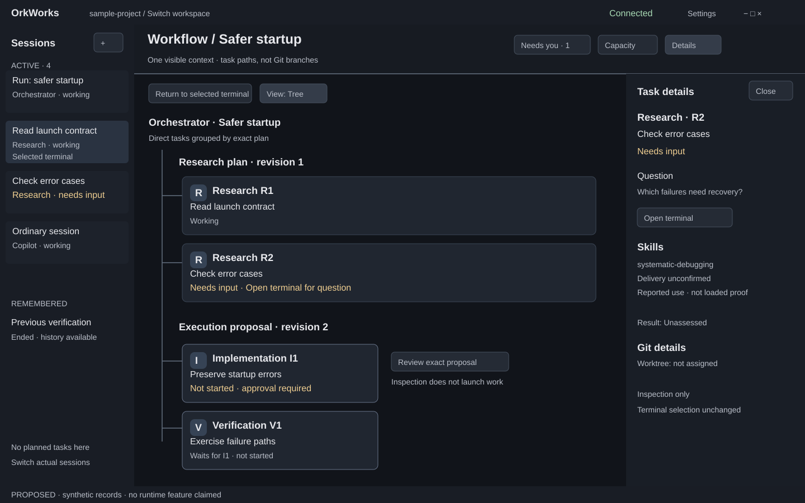
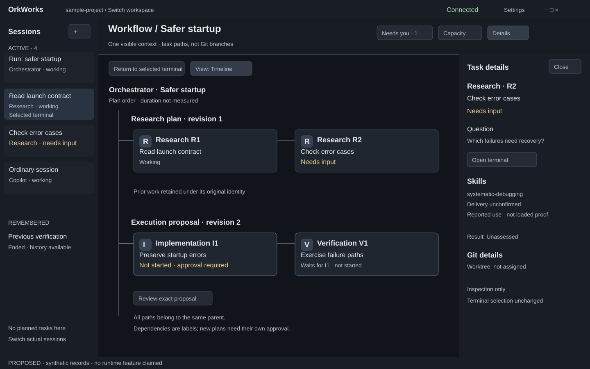
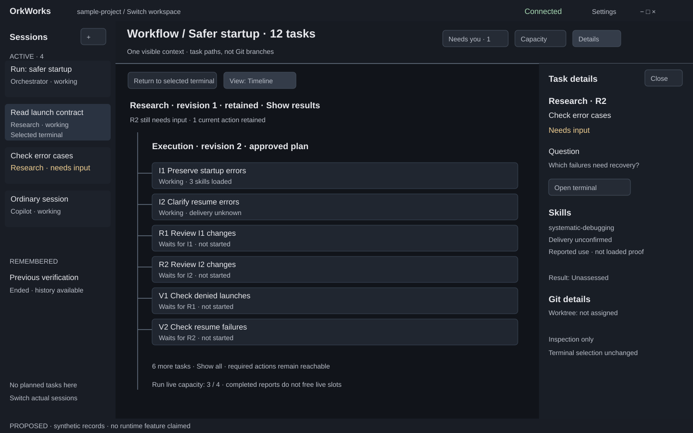
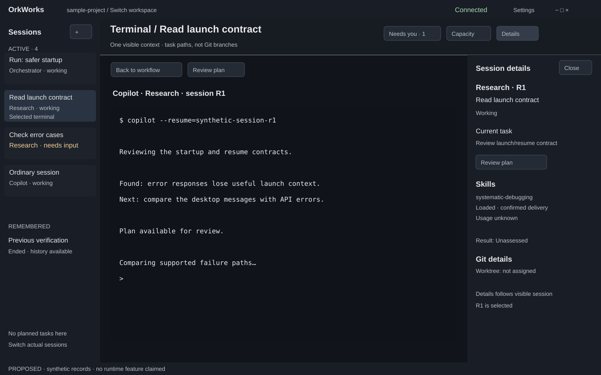
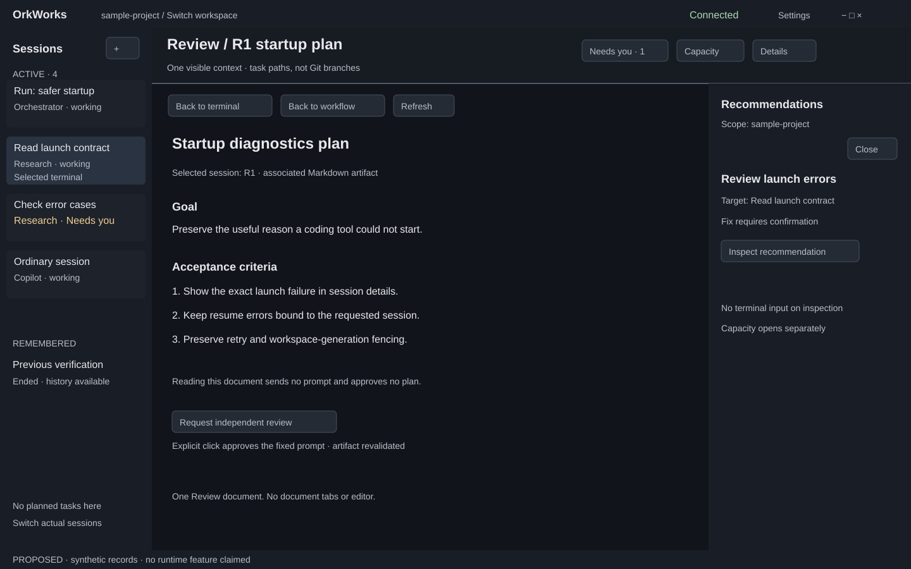
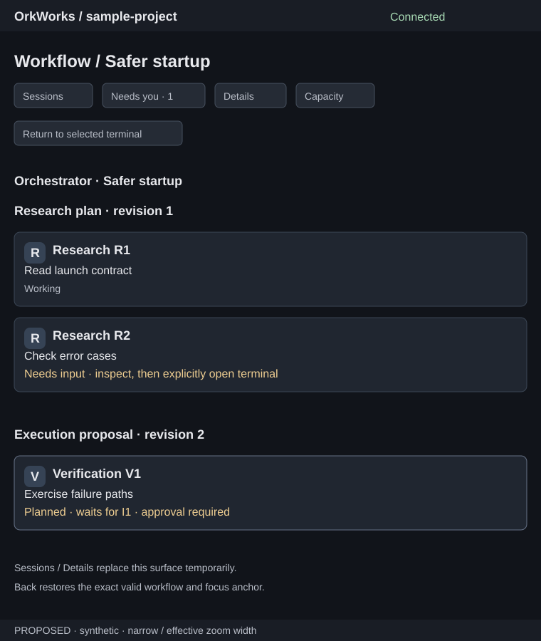

# Application shell and workflow navigation

- Status: approved design; runtime implementation and separately gated Workflow integration are not implemented
- Date: 2026-10-05
- Owner approval: 2026-10-08
- Tracking: [#755](https://github.com/Rambolarsen/orkworks/issues/755), prerequisite of [#746](https://github.com/Rambolarsen/orkworks/issues/746), initiative [#738](https://github.com/Rambolarsen/orkworks/issues/738)
- Baseline inspected: `d48cc2159219c09b2575b8f25a45cb58bc68f23b`
- Inputs: [hierarchy interaction](2026-10-04-agent-hierarchy-ui-design.md), [product direction](2026-10-04-agent-hierarchy-and-configuration-learning-design.md), [accepted orchestration scope](2026-10-04-taskmaster-orchestration-scope-design.md)

## Purpose, scope and accepted decisions

Replace panel tabs and drag-and-drop arrangement with a predictable shell for
observing sessions and moving deliberately between work and its overview.
Keep Sessions compact. Put the tree or branching workflow timeline in the
central area in place of the terminal. Lead with agent tasks and progress;
Git references belong in inspected details.

The owner selected #755 for specification work on 2026-10-05 and approved the
shell direction and defaults in writing on 2026-10-08. The accepted direction
is a compact Sessions sidebar, one central surface, and one optional
contextual inspector. This document and its synthetic drawings define the
accepted shell contract; they do not implement navigation, qualify coding-tool
profiles, or authorize orchestration launches.

The owner chose **restore the last central view** during drafting on 2026-10-05
and approved the complete default set on 2026-10-08. Always validate the
remembered target before restoring it. Use the branching timeline for workflow
stages with a tree presentation available; keep the inspector closed until
requested; open an explicitly selected session in Terminal. Restoration never
selects or resumes a session and never grants an action.

Preserve one selected terminal and one central context. Ordinary sessions work
without any orchestration extension. No editor, tiled terminal, native subagent
controller, Git mutation, automatic retry, autonomous integration, or peer
instance dashboard is introduced.

## Investigated current behavior

| Source | Implemented behavior | Required change in the proposal |
| --- | --- | --- |
| `apps/desktop/src/components/DockviewApp.tsx` | Sessions left; Detail below Sessions; Terminal center; Capacity and Recommendations right; reusable Review in Terminal's group | Replace movable panel groups with fixed regions and explicit central navigation |
| `apps/desktop/src/App.tsx` | Selecting an actual session activates Terminal and acknowledges only that session; Review activates a reusable document panel | Retain explicit session selection; separate workflow inspection from terminal selection |
| `apps/desktop/src/App.tsx` menu-command handler | Sessions shortcut reveals/focuses the list, then hides it when already focused; other panel commands toggle panels | Preserve the Sessions shortcut contract; map other saved commands explicitly rather than silently dropping them |
| `apps/desktop/electron/menuTemplate.ts` | Saved accelerators, native menu roles, shortcut-capture suppression, per-panel View checkboxes | Retain user accelerators and capture suppression; replace panel toggles with surface/inspector commands |
| `apps/desktop/electron/layoutMemory.ts` | Installation-level `layout.json`; arbitrary JSON accepted, Dockview deserializes in renderer | Treat legacy docking data as presentation only; create bounded versioned shell preferences through Electron |
| `apps/desktop/src/workspaceSessionController.ts` | Workspace/foreground generations fence asynchronous work; remembered selection restores only a matching non-dead session | Revalidate every remembered destination; preserve existing session restoration and lifetime rules |
| [Session Plan Review](../../../specs/session-plan-review.md) | One selected-session Markdown artifact; reading is separate from the explicitly approved fixed review prompt | Keep one Review surface, exact document target, refresh/error handling and separate Request independent review action |
| [ADR 0011](../../adr/0011-dockview-panel-layout.md) | Historical decision for movable panels and terminal tabs | Superseded by accepted ADR 0078; retain Dockview for fixed-region resizing with drag-and-drop disabled |
| [ADR 0013](../../adr/0013-single-active-context-primitive.md) | Historical session-only context and session-bound Details decision | Superseded by ADR 0078, preserving one central context and one terminal |
| [ADR 0002](../../adr/0002-electron-react-typescript-desktop.md) and [Taskmaster UI](../../../specs/taskmaster.md) | Historical three-column shell and Dockview recommendation panel | Reconciled to compact Sessions, one central surface and optional inspector; Electron/React/TypeScript and Taskmaster authority remain |

### Uncertainty and blind-spot checkpoint

**What am I least confident about?** Whether a shell redraw could silently
change terminal selection, unread acknowledgement or process lifetime. The
selection handler acknowledges a real session and foregrounds its terminal;
#746 requires inspection to do neither. Treat these as separate transitions,
using canonical session IDs. Surface hiding detaches presentation only;
[ADR 0022](../../adr/0022-session-runtime-owned-pty-lifetime.md) keeps PTY lifetime
in the sidecar. A future integration fixture must verify output drains while
Workflow or Review is visible.

**What might the project be missing?** “Restore layout” currently means an
installation-wide docking arrangement, whereas restoring a task or document
would be workspace-specific and generation-sensitive. Never replay an old
run action or infer a session from a layout. Also, ordinary Review reads a
selected session's artifact; approving an orchestrated exact plan is a different
authority path. Share visual space only, not tokens, approval semantics or
implicit submission. Native window dragging remains necessary even though
panel dragging is removed.

Investigated facts above come from the source and existing contracts. Remaining
risks: upstream #743/#744 projections are unfinished; timeline timestamps may be
absent; vendor references do not prove OrkWorks capability. The accepted design
retains unknown states and isolates Workflow integration behind those gates.

## Dated reference comparison

Sources were read on 2026-10-05. These are bounded design references, not
claims about the latest installed products or adapter eligibility.

| Reference / evidence boundary | Relevant documented pattern | OrkWorks interpretation |
| --- | --- | --- |
| [Cursor 2.0 release, 2025-10-29](https://cursor.com/changelog/2-0) | Sidebar for agents/plans; easier review of an agent's changes | Use a compact work index and explicit review access; retain OrkWorks' coding-tool hosting boundary |
| [Claude Code desktop redesign, 2026-04-14](https://claude.com/blog/claude-code-desktop-redesign) | Active/recent-session sidebar, selectable information density and review access | Borrow session switching and progressive detail. The announcement gives a dated release, no desktop build number; no installed-build parity is claimed |
| [Copilot CLI 1.0.90 retained help](../../validation/fixtures/copilot-1.0.90/help.txt), [capture manifest](../../validation/fixtures/copilot-1.0.90/manifest.json), [release](https://github.com/github/copilot-cli/releases/tag/v1.0.90) | Captured help supports interactive mode and explicit session resume selection | Preserve deliberate exact-session navigation. This packet contains no captured interactive UI, so it establishes no sidebar/timeline layout for 1.0.90 |

The [current Copilot command reference](https://docs.github.com/en/copilot/reference/copilot-cli-reference/cli-command-reference)
describes a timeline, task details and session browsing. It is a dated reading of
rolling documentation, not version-bound 1.0.90 evidence. Its task navigation
suggests progressive disclosure; this inference does not qualify native subagent
control or exact resume in OrkWorks.

Vendor drag/tile/editor features are outside this proposal's requirements.
OrkWorks is observing the underlying coding tool, not reproducing its agent
conversation, editing or integration product.

## Approaches and recommendation

| Approach | Benefit | Tradeoff |
| --- | --- | --- |
| A — compact sidebar, central surfaces, contextual inspector (recommended) | Predictable session switching; ample workflow/terminal space; one clear inspection target | Requires explicit return destinations and inspector binding |
| B — sidebar-led navigation with an expanded hierarchy beside Terminal | Hierarchy remains visible while working | Reintroduces the intrusive sidebar the owner rejected; leaves little room for tasks/skills |
| C — overview-first full-width canvas with a session picker only | Largest graph area; few permanent regions | Ordinary sessions and attention switching become less discoverable; adds navigation for frequent terminal use |

Choose A. Its sidebar carries session-level awareness; the central workflow
overview carries declared task/stage relationships. The selected layout library
is Dockview 8.3.1 for fixed-region resizing and programmatic view hosting, with
drag-and-drop disabled and group headers hidden. The package is pinned in
`apps/desktop/pnpm-lock.yaml`; this does not upgrade the dependency.

## Shell regions and responsive defaults

At a logical content width of at least 1180 CSS px, use a 240px Sessions
sidebar (resizable 200–320px), the remaining central area, and an optional
320px inspector (resizable 280–420px). Central content gets at least 560px.
Clamp widths before opening the inspector; if they cannot fit, use compact
behavior. Sizes are proposed defaults, not fixed text sizes or minimum window
dimensions. Native app chrome is outside these measurements.

At 860–1179px, keep Sessions at its bounded width when it fits and replace
central content temporarily with the requested inspector detail page. Below
860px, show one content region: Sessions and inspection open temporary pages
with labeled return destinations. Do not place another session's detail page
over a visible terminal. At 200% text zoom, apply the same rules to effective
logical width; labels wrap and actions remain reachable. The native window
remains resizable and draggable.

The app header preserves workspace switch, connection status, native controls
and Settings. A content header shows the exact context title/breadcrumb and
actions: Sessions, Workflow when available, Details, Actions with current
counts, Capacity. Workflow can open the run chooser without a selected session
or validated owning run; unavailable projections show an explanation. These
open destinations; they are not persistent panel tabs.
No floating, docking, view reordering or document-tab strip exists. Resize
handles adjust fixed regions only and have keyboard-operable separator controls.

Details, Actions, Recommendations and Capacity share the optional inspector;
only one is visible there. Capacity and recommendations keep explicit workspace/tool
scope labels and their existing unavailable/disabled states. A utility's return
action restores the prior valid detail subject, never a stale session. Closing
an inspector restores focus to its invoker without changing selection.

Required-action counts remain visible when Sessions/inspector are hidden. Keep
session attention counts separate from proposed run decisions and recommendation
counts; do not sum the same obligation twice or label historical attention as
live. Unknown/partial data displays “Actions unavailable” or a labeled partial
count, never an invented zero. New attention updates counts without switching
views or focus. Ordinary status comes from canonical SessionInfo.

## Central destinations and state ownership

Logical UI state, not an accepted IPC schema:

- Workspace identity and runtime generation fence all ephemeral state.
- `activeSessionId` remains the sole ordinary terminal selection.
- `surface` is Terminal, Workflow, Review, or a temporary compact page.
- Workflow has an exact run ID and inspected run/plan/revision/task reference,
  stable disclosure/focus/scroll anchors and presentation choice.
- Review has the exact selected session and current validated artifact identity,
  plus a bounded return descriptor. It never stores prompt content or grants.
- Inspector is closed, context details, workspace Actions, workspace
  recommendations, or capacity; context details derive from the current
  surface's subject. Actions has exact workspace/generation scope, an inspected
  obligation key/type and a bounded central return descriptor.
- The run chooser has exact workspace/generation scope and validated run IDs
  ordered by stable creation sequence; it is a temporary navigation page, not
  terminal selection or a run creation command.
- Navigation remembers at most one valid return descriptor per central surface,
  not an unbounded browser history. Lost targets fall back visibly.

| Trigger | Destination / selection | Details, focus and unread |
| --- | --- | --- |
| Select actual session in Sessions | Terminal for that exact ID; ordinary dead-session history remains available | Bind Details to that session; acknowledge only through existing explicit selection semantics; retain list focus until Enter/Focus terminal |
| Open Workflow from selected child/root | Owning exact run's overview; active terminal ID stays latent | Reveal that node; bind inspector to overview inspection; focus overview heading/previous anchor |
| Choose run from any context / Open Workflow without an owning run | Temporary run chooser; no inferred membership or graph | Preserve active session and central return; focus chooser heading/current run; unavailable projections are labeled |
| Choose another retained run | Workflow for that exact validated run ID, including runs with an unavailable parent session | Change overview only; restore that run's valid anchors or heading; no session selection/acknowledgement; stale choice leaves chooser with an explanation |
| Close run chooser / Return to terminal from Workflow | Prior valid central destination / retained selected session's Terminal | Restore invoker/heading focus without selection; missing terminal offers Sessions without selecting a replacement |
| Inspect planned/live workflow node | Same Workflow, exact inspected target | No session selection, unread acknowledgement, resume or launch; focus inspected node/details command |
| Show next action | Reveal next validated obligation in the current Workflow, or open Actions and focus its exact row | Navigation only; session attention reveals its row without selecting it; missing/stale targets show unavailable and refresh, with no fallback execution |
| Open terminal/history from node | Terminal for validated actual session ID | Select explicitly, acknowledge only that session, focus terminal/history; record owning run return |
| Back to workflow from Terminal | Exact current session's owning run, if still valid | Restore overview anchors; unrelated cached run is never displayed as its workflow |
| Review plan from session detail | One Review surface for selected session's readable Markdown artifact | Current selected session remains exact; focus document heading; store Terminal return |
| Review associated artifact from workflow task | First explicitly select its exact ordinary session, then open Review | This action acknowledges that session as explicit selection; record exact Workflow return; planned nodes without an associated session have no ordinary Review action |
| Close Review / Back to terminal | Same selected session's Terminal/history if valid | Restore document invoker/terminal focus, no second selection or prompt submission |
| Back to workflow from Review | Recorded exact run/task, if still valid | Restore overview focus; otherwise show why return is unavailable and offer selected Terminal |
| Open Details / Actions / Capacity | Wide: corresponding inspector state; compact: temporary page | Actions is workspace-scoped; Details follows visible subject; Capacity keeps workspace/tool scope. Preserve central return and invoker focus; no session selection |
| New session successfully created | Terminal for newly created exact session | Existing creation authority and failure handling retained; never interpret it as a run/child creation |
| Workspace starts switching or backend generation changes | Clear/fence old ephemera and gate commands through existing lifecycle | No late old overview/document/detail can paint the new workspace; no silent launch/resume |

Actions is a read-only workspace overview with separate groups for canonical
session attention, exact run decisions/unviewed results, and recommendations.
Entries retain their source's stable identity and subject/version; unavailable
sources are labeled rather than flattened into a zero. It adds no approval or
execution endpoint. Inspecting an entry opens its scoped details; an explicit
Open terminal/history, Review exact proposal, or existing recommendation command
performs the separately labeled transition and retains its existing authority.
Show next action follows the current overview's declared action order; outside
Workflow it follows the displayed Actions order, with session attention first,
then run obligations in stable run/stage/task order, then recommendations in
their existing order. It never selects a terminal or approves a result. If the
target cannot be inspected in a validated overview, focus its Actions row with
an unavailable explanation. Closing Actions restores the prior valid central
subject and invoker; refreshing/removing its inspected entry clears stale detail.

When reviewing another task's ordinary artifact, label the action with that
session and the consequence: “Review R2 plan — switch session”. Distinguish it
from “Review exact proposal”, which opens the run's version-bound approval
details without selecting an ordinary session or sending a review prompt.

The terminal is hidden while Workflow/Review/compact pages are central. Its PTY
continues under sidecar ownership; renderer attachment can detach without
ending the process. Reattach the exact selected runtime according to the
existing terminal contract, preserve output/history, refit to the current
viewport, and never send input while focus belongs to navigation/document UI.
Changing presentation must not create another terminal runtime.

Terminal Details always describes its selected session. Workflow Details
describes the inspected task/run only while the overview is visible. Review
Details describes its selected session/artifact. The inspector clears or
rebinds synchronously on a destination change before fetching details.

Recommendations retain existing approval/fix behavior. An action that targets
a different actual session must make that exact selection explicit before
confirmation; never inject into the latent terminal because a workflow node
was inspected. Capacity inspection sends no input. Run approval/cancel/finish
uses separately reviewed #610/#742 Electron-owned commands and exact subject
versions. Reading Review or a summary is not approval, viewed-result acceptance
or review-prompt submission.

## Tree versus branching timeline

Both presentations use the same validated #746 ownership, stable task keys,
declared order, attention/evidence and accessible linear outline. Session
switching is never driven by node selection alone. No graph editing or drag
gestures create tasks.

The tree emphasizes direct parentage: one orchestrator root, non-agent plan
headings, direct declared task children. It is easier to scan short runs and
offers the clearest keyboard/screen-reader structure. It requires expanding
stages to compare how work evolved.

The branching timeline emphasizes declared stage progression: the orchestrator
is the continuing trunk; research, implementation, review and verification
paths attach as direct tasks under their exact plan headings. Dependencies
are separately labeled “Waits for I1”, never encoded as child delegation.
Use stage order rather than a duration scale unless authoritative timestamps
are available. Missing time is labeled unavailable. Earlier paths/results
retain exact plan/result identities as later proposals appear. Dashed planned
cards read “Not started · approval required”; drawing them grants nothing.

Proposed default: timeline for an available run, with a labeled Tree/Timeline
presentation selector inside Workflow. It changes presentation only; keep
inspection, selected terminal, focus anchors and disclosure semantics. Under
narrow width/zoom, render an ordered outline with plan/time labels instead of
compressing a branching canvas. Preserve the explicit outline alternative on
wide screens for keyboard/assistive users.

For absent orchestration records, keep the ordinary session terminal and
switcher; there is no fabricated run trunk. For incomplete/corrupt lineage,
show the unavailable state and allow ordinary session switching. The entire
workflow feature remains separately gated by #610 and its projections.

## Review, attention and lifecycle details

Review reuses the selected-session artifact validation, unreadable/missing
messages and refresh behavior. One document is visible; no browser/file editor
or additional document tabs. Opening another session closes/replaces the old
document subject. A changed artifact invalidates pending prompt/approval
bindings and is displayed as changed, not as an approved snapshot. The fixed
Request independent review action retains the existing explicit-click approval
and authenticated Electron-to-sidecar revalidation; it adds no native dialog.
Reading or refreshing cannot send the fixed prompt.

Attention navigation is two-step when coming from Workflow: Show next action
inspects/reveals the exact target, then Open terminal/history or Review proposal
opens the required context. Sessions remains a direct exact-session switcher.
Collapsed stages retain required-action rollups. Late attention does not expand
an unrelated document or focus the terminal automatically. Existing explicit
acknowledgement and alive-versus-remembered behavior remain authoritative.

If the selected session is forgotten, clear it through the ordinary lifecycle
path and show the no-selection state. If an inspected node disappears, focus
its retained stage/root or the overview heading with an explanation. If the
parent is missing, preserve surviving child navigation and ordinary management.
Ending a run, hiding a panel or resetting shell presentation never kills a
session. Backend unavailable and workspace conflict use existing retry/control
gates; the shell adds no fallback sidecar or replacement session.

## Keyboard, accessibility and motion

Retain saved existing hotkey chords; revalidate duplicates/reserved/native
chords during the separately reviewed settings migration. No new global
accelerator is assigned in this specification. Workflow and Review commands
are reachable through labeled buttons and the View menu; new customizable
commands, if desired, require explicit settings scope approval.

| Existing command identity | Proposed meaning |
| --- | --- |
| New session | Existing ordinary creation dialog |
| Sessions | Reveal/focus Sessions; hide only when already focused; narrow page closes to exact invoker on repeated command |
| Detail | Toggle current-subject Details; never expose unrelated inspection beside Terminal |
| Terminal | Show/focus the exact selected Terminal/history; repeating keeps it visible rather than hiding the sole central surface |
| Capacity / Recommendations | Open/focus respective inspector/page; repeating that active utility closes it and restores focus |
| Reset Layout | Reset region widths, visibility and presentation defaults; no session lifecycle or workspace operation |

Use semantic buttons, landmarks, headings and a Sessions listbox. Sessions
Up/Down retains existing explicit selection behavior; Enter focuses its
terminal. In Workflow, arrows traverse the outline/disclosures, Enter inspects,
and Open terminal is a separately named button. Preserve #746's rule that
inspection/focused descendants prevent an otherwise surprising collapse.

Tab enters/leaves region controls in logical order. Compact pages trap no
focus outside a true modal; Escape closes only the owned temporary page and
returns to its invoker. Global Escape/arrow handling never consumes xterm input.
Review Escape applies only with focus in the document/navigation surface, not
the terminal. On target loss, focus the nearest valid heading and announce why.

All status/action meaning has visible text. Skill delivery and usage keep
separate labels, accessible overflow and unknown states. No hover-only action,
color-only line meaning, autoplay graph motion or rapidly repeating highlight.
Reduced motion removes transitions while retaining event labels. Text zoom
does not shrink labels, overlap controls or conceal required actions. Screen
reader announcements report meaningful state changes, not every PTY line.

## Saved layout migration and layout library

Do not feed legacy Dockview JSON into the new fixed shell. The
installation-level `shell-layout.json` version 1 stores bounded region widths,
Sessions visibility, density and tree/timeline preference only; it contains no
session/run IDs, workspace paths, document content, tokens or grants. Target
byte limit: 16 KiB. Validate exact field vocabulary, numeric limits and finite
values. Unknown/corrupt/future versions use defaults in memory and surface a
diagnostic; preserve original bytes. Never overwrite an unreadable/future file
until an explicit reset/rebuild choice is confirmed.

Keep existing `layout.json` untouched for downgrade safety. First valid use of
the new shell starts from fixed defaults and says “Your saved panel arrangement
is retained; this version uses a fixed layout.” Do not guess widths from
arbitrary dock positions or restore hidden central panels. New writes use
Electron-owned bounded validation and atomic same-directory replacement; a
failed save leaves the current UI usable, preserves the last valid record and
reports failure. Reset Layout changes presentation; it does not delete the
legacy record or unrelated app settings/hotkeys.

Per-workspace remembered navigation needs a separate bounded record using the
existing canonical workspace key, at most 20 remembered workspace entries and
64 KiB total. Store `lastCentralSurface` (exactly Terminal, Workflow or Review),
optional run ID and overview anchors only. Temporary Sessions/Details/Actions/
Capacity pages and the run chooser are non-restorable; opening one retains the
underlying central destination for persistence and never saves its ephemeral
invoker, focus or return descriptor. Unknown surface values are invalid.
Entries are an ordered most-recent-first list. After a validated central
navigation succeeds in a ready workspace, its successful save transaction
moves that workspace entry to the front; transaction order, not wall-clock
sorting, defines recency across instances. Read/restore, polling, attention
updates and temporary-page inspection do not change recency. Within the same
locked revision transaction, evict entries from the least-recent end until both
the 20-entry and 64-KiB serialized-record limits hold, protecting only the entry
being written. Opening a 21st remembered workspace therefore removes the oldest
other entry. This is presentation retention, not knowledge of other instances'
current workspaces. If the protected entry alone cannot fit, reject the entire
save without committing any evictions, preserve the previous bytes and report
failure. Explicit workspace deletion removes its entry under the same protocol.

The sidecar's `lastActiveSessionId`, restored through the existing controller's
non-dead-match policy, is the sole durable selection authority. Navigation
restoration cannot replace it, call ordinary selection/acknowledgement, or
restore a dead session. Revalidate after ready restoration; never persist
runtime generation authority, action versions, artifacts/prompts, credentials
or approval state. Review restores only for the sidecar-restored selected
session's currently readable validated artifact, clearly labeled with its
current identity; no old artifact identity is implied. Otherwise fall back to
Terminal with a reason. A missing overview falls back to the existing valid
selection or an empty terminal state, without automatic resume. Workspace
deletion forgets its navigation record; each independent instance has no peer
discovery/focus authority. Persistence failure cannot gate ordinary sessions.

Electron owns both shell records, including a monotonic revision and an opaque
creation epoch as storage metadata. Use bounded nonblocking advisory locking on
a retained installation-scoped lock file, following the existing workspace
history contract: never unlink, replace or evict the lock inode by age. First-use
initialization is a separate locked transaction that establishes a valid epoch
and revision before admitting intents; reread any record another instance has
already created rather than replacing it.

Each Electron instance serializes preparation and commit through one writer
queue. At enqueue, Electron binds every intent to the record epoch/revision of
its last validated snapshot and the exact originating workspace/generation.
Renderer events provide only desired presentation changes. An intent never
acquires a new causal base merely because preparation was delayed. Coalesce
unprepared presentation updates for the same record/workspace using the latest
intent's own causal base. Reset/deletion remains an ordering barrier; it cancels
queued pre-barrier saves for its affected subject.

Prepare the next transaction after its predecessor finishes. Starting from the
intent's enqueue-time base, advance its expected revision only along an unbroken
chain of verified, successful, non-barrier commits made by this same local writer
to that record. Never advance across a reset/deletion, failed transaction, epoch
change, or revision seen only by rereading shared storage. Track this local proof
only while a pending intent needs it; it is not durable instance/peer history.
Thus two rapid local saves can follow one another, while another instance's
intervening reset/deletion leaves a revision gap and rejects the older intent,
even if it had not yet been prepared. A fresh read updates the snapshot for
future user intents; it cannot legitimize an existing queued event.

Before preparation, revalidate workspace/generation; switching/disposal drops
invalidated requests rather than retargeting them. Under the lock, reread and
validate the record and require its epoch/revision to equal the intent's derived
expected base. On mismatch, reject the intent and discard other queued events
whose causal chain depends on that rejected base; refresh for a later user change,
without automatic replay. Any failed transaction likewise invalidates its local
successor chain and drops dependent queued intents, even when the persisted
revision is unchanged. Refresh before admitting a later user intent; an existing
queued event cannot retry the failed chain. Apply only the operation's fields/entry, enforce bounds,
reject revision overflow, increment revision, flush a same-directory temporary
file, atomically replace and verify read-back before admitting a local successor.
Never write an in-memory whole-history snapshot. Normal reset, deletion and
retention mutate the revisioned container; they do not remove or rewind it.
Explicit reconstruction of a missing/corrupt record creates a fresh epoch, so
old queued intents remain invalid even if its new revision starts at zero.
Lock contention or failed validation/save preserves existing bytes and reports
failure while the current view stays usable.

The startup default is the last valid central view. First use/no remembered
view opens Terminal for the existing valid selection, or the ordinary empty
state. Never start a run or session to fill a remembered view. Do not persist a
workspace's navigation under another workspace during a switch.

The owner approved removal of Dockview on 2026-10-10 after reviewing the
replacement preview. [ADR 0082](../../adr/0082-react-grid-desktop-shell.md)
supersedes this design's original Dockview retention choice. Use React and CSS
Grid for fixed regions and renderer-owned pointer/keyboard separators; retain
the responsive, focus, single-context and persistence contracts above. Remove
the Dockview dependencies and panel API without adding a replacement docking
library. Legacy layout bytes remain unchanged for downgrade safety.

The original Dockview investigation informed ADR 0078; it is historical evidence,
not the current library requirement. Review and Actions remain separately owned
follow-ups under #780 and #805.

## Authoritative amendment sequence

The accepted shell direction requires the following authoritative
reconciliation. Runtime implementation remains separate and is not represented
as shipped behavior.

1. Create ADR 0078 as the accepted replacement, superseding ADR
   0011's movable panels/tabbed Terminal requirement, ADR 0013's session-only
   context/detail binding, and ADR 0002's mandatory three-column/right-sidebar
   layout decision. Preserve Electron/React/TypeScript, one visible central
   context, one visible terminal, deliberate session switching and the compact
   Sessions index. Record fixed regions, Workflow/Review contexts, visible-subject
   detail binding, retained resizing, concurrency-safe persistence/migration,
   and Dockview with drag-and-drop disabled and group headers hidden. Keep all
   three old ADRs as historical;
   update their superseded status/links and the ADR index. Carry preserved stack
   constraints into the replacement so ADR 0002's supersession cannot imply a
   technology change. Update root ADR pointers and product-design constraints
   in the same accepted change; do not leave session-only binding authoritative.
2. Reconcile [independent workspace instances](../../../specs/multi-workspace.md)
   and [ADR 0060](../../adr/0060-independent-workspace-instances.md): replace the
   visible *session* context requirement and ADR 0013 preservation reference
   with one visible central context under the new shell ADR. The new ADR
   explicitly supersedes only ADR 0060's session-only context clause; add a
   dated replacement pointer there while keeping its independent-instance,
   one-workspace/sidecar, path-only history, lease and cleanup ownership decisions
   accepted. Navigation memory is a separate presentation record, not a peer
   registry or a change to workspace-history authority.
3. Amend [MVP shell scope](../../../specs/orkworks-mvp.md#electron-desktop-shell):
   replace VS Code-like three-column/mandatory-right-sidebar wording with
   compact Sessions, one central Terminal/Review/eligible Workflow surface and
   an optional contextual inspector; preserve native window and Electron
   security/lifetime rules. Update selected-session association and hotkey
   behavior descriptions where they currently require tabs/panel hiding.
4. Amend [Taskmaster](../../../specs/taskmaster.md)'s UI implications and milestone
   requirements: replace its Dockview panel/mandatory right-side action overview
   with the scoped Actions/Recommendations inspector or compact page. Retain
   recommendation approval, explicit session targeting, unavailable states and
   every existing control/authority boundary.
5. Amend [Session Plan Review](../../../specs/session-plan-review.md) so Review
   plan opens the single reusable central Review surface with explicit return
   navigation, retaining artifact/path constraints and the existing explicit
   Request independent review click as approval, without an added native dialog.
   Add a dated [ADR 0034](../../adr/0034-user-approved-session-review-prompt.md)
   amendment replacing the Details-panel placement reference with the same
   selected-session action on central Review. Its narrow user-approved fixed
   prompt decision stands: session ID only from renderer, Electron authentication,
   sidecar path containment/revalidation, one live-PTY write and event recording;
   no generic terminal-write API or independence claim is added.
6. Reconcile #746 and the [hierarchy product direction](2026-10-04-agent-hierarchy-and-configuration-learning-design.md)
   with the accepted shell, replacing provisional placement/mockups and binding
   keyboard, run chooser, compact behavior and inspection to these transitions.
   Update its ADR 0013 amendment wording to replacement/supersession and its
   explicit-only Workflow startup wording to the owner-selected validated last
   central view restoration; neither restoration nor inspection grants execution.
   Update [architecture](../../agents/architecture.md#dockview-panel-layout),
   [product boundaries](../../agents/product-boundaries.md#single-active-context-ux-invariant),
   root guide pointers and docs landing claims when their described behavior
   actually changes. Do not advertise an installer feature from a proposed spec.

## Mockups and bounded walkthrough

All labels, statuses, records and terminal text are synthetic. The same run is
used for tree/timeline comparison. Lines show parent-owned workflow paths;
dependencies are textual. No rendered line is a measured duration or Git graph.

### Low-density tree

### Low-density branching timeline

### High-density timeline

### Terminal and session-bound details

### Central Review and workspace actions

### Narrow window / effective zoom width

| Task | Walkthrough / acceptance oracle |
| --- | --- |
| Find required attention | Actions count remains visible; Show next action reveals/inspects R2; Open terminal explicitly selects R2 and acknowledges only it |
| Switch agents | Compact actual-session row opens its exact terminal; Enter focuses xterm; workflow inspection does not alter that selection |
| Inspect planned verification | V1 details show not started and dependency/approval state; there is no fabricated terminal or launch button |
| Understand research → execution | Earlier research stage retains results; new proposal reads Awaiting approval; inspection grants nothing |
| Review a plan | Review plan selects one validated artifact; Back to terminal restores the exact session; Request independent review remains a separate explicit approval click |
| Return after changing sessions | Workflow resolves from the newly selected session's ownership; unrelated old run/details cannot appear beside its terminal |
| Find recommendations/capacity | Explicit inspector/page scope labels; details restores to the current context; no recommendation sends into an inspected-only node |
| Use narrow width/200% zoom | Central outline stays readable, temporary pages have return actions, all attention/status/skill details remain reachable |
| Reset old layout | Fixed presentation resets; legacy JSON, hotkeys, session processes and metadata remain intact |

This walkthrough is an expert contract/artifact check, not a measured usability
study or a shipped accessibility result. Future runtime acceptance requires
real keyboard, assistive-technology, zoom and PTY lifecycle tests.

## Validation cases and implementation handoff

Before an executable runtime plan, cover: inspection without selection/unread
effects; explicit session selection and terminal focus; stale workspace/run/
artifact/generation replies; unavailable ownership; planned nodes; forgotten
targets; parent loss; collapse with focused descendants; Review target drift;
same-session terminal reattachment; detached output drain; inspector scope
changes; hotkey migration/capture; width/zoom transitions; malformed/future
layout records; 20-to-21-workspace and byte-budget eviction, protected-entry
oversize rejection, recency unchanged by attention/temporary pages; concurrent
save/deletion and stale revision rejection; rapid same-instance navigation/resize,
coalescing and deletion/reset ordering, queued workspace-generation invalidation;
external reset/deletion between enqueue and preparation, unknown revision gaps,
reconstructed-record epoch mismatch; first-use initialization races, failed-save
successor invalidation, lock contention/atomic-save failure; sidecar selection precedence; retained runs with
missing parents and stale chooser targets; Actions scope/return; exact approval
with no renderer authority; and ordinary sessions with no orchestration projections.

Shell direction and defaults were approved on 2026-10-08, and authoritative
spec/ADR reconciliation is recorded in this PR. The reviewed implementation
plan is [2026-10-08-application-shell-redesign.md](https://github.com/Rambolarsen/orkworks/blob/main/docs/superpowers/plans/2026-10-08-application-shell-redesign.md).
Create scoped runtime issues only after the owner reviews that plan. Keep
ordinary shell work separable from orchestration availability; Workflow
projection integration waits for #610/#741/#743/#744/#746 agreement, and
approval IPC remains the #610/#742 owner's unit.

Documentation checks for this deliverable: diff whitespace, doc drift,
VitePress build/dead links, SVG XML plus rendered clipping/contrast/label
inspection, and a requirement-by-requirement self-review. Keep #755 and #746
open for the reviewed execution handoff and remaining #746 projection gates. No
runtime or coding-tool capability claim follows from those checks.

## PR #796 native validation timing exception — approved 2026-10-10

The owner deferred native walkthroughs until after merge of PR #796. Actual
keyboard, screen-reader, reduced-motion, zoom, narrow-width and native chrome
evidence remains required before a release containing this change and is tracked
in [#836](https://github.com/Rambolarsen/orkworks/issues/836). Automated fixtures
are partial evidence and do not mark those walkthroughs complete. See
[ADR 0082](../../adr/0082-react-grid-desktop-shell.md) for the scoped delivery exception.
